# 肯葳科技亚马逊自动运营系统 — 完整使用指南

> **版本**：3.0 | **最后更新**：2026年3月
> **适用对象**：亚马逊运营人员、产品经理、业务负责人
> **技术要求**：无需编程基础，按步骤操作即可

---

## 目录

- [第一章：系统简介](#第一章系统简介)
- [第二章：环境搭建（Mac）](#第二章环境搭建mac)
- [第三章：环境搭建（Windows）](#第三章环境搭建windows)
- [第四章：AdsPower 配置](#第四章adspower-配置)
- [第五章：首次使用 — 快速开始](#第五章首次使用--快速开始)
- [第六章：系统界面详解](#第六章系统界面详解)
  - [6.1 控制中心](#61-控制中心-control-center)
  - [6.2 竞品分析](#62-竞品分析-competitor-analysis)
  - [6.3 产品清单](#63-产品清单-product-list--pricing-model)
  - [6.4 词库整理](#64-词库整理-keyword-library)
  - [6.5 广告指标监测](#65-广告指标监测-ads-monitoring)
  - [6.6 定价策略](#66-定价策略-pricing-strategy)
  - [6.7 流量入口](#67-流量入口-traffic-sources)
  - [6.8 关键词差距分析](#68-关键词差距分析-gap-analysis)
- [第七章：多产品管理](#第七章多产品管理)
- [第八章：Excel 报告使用指南](#第八章excel-报告使用指南)
- [第九章：手动数据采集（不使用 AdsPower）](#第九章手动数据采集不使用-adspower)
- [第十章：配置文件详解（config.json）](#第十章配置文件详解configjson)
- [第十一章：Docker 部署（高级）](#第十一章docker-部署高级)
- [第十二章：常见问题与故障排除](#第十二章常见问题与故障排除)
- [第十三章：已知 Bug 修复记录](#第十三章已知-bug-修复记录)
- [附录](#附录)

---

## 第一章：系统简介

### 1.1 系统是做什么的？

**肯葳科技亚马逊自动运营系统**（ECOMMERCEAUTOMATION）是一套专为亚马逊卖家打造的数据分析与运营决策工具。它能够：

1. **自动采集数据**：从卖家精灵（SellerSprite）和亚马逊卖家后台（Seller Central）自动获取关键运营数据
2. **智能分析处理**：对关键词、竞品、广告、流量等维度进行深度分析
3. **生成运营方案**：输出专业的 Excel 运营报告和交互式网页仪表盘
4. **支持多产品管理**：可同时管理多个产品的运营数据，每个产品独立分析

简单来说，系统的工作流程如下：

```
输入数据                      处理引擎                    输出结果
┌──────────────────┐     ┌──────────────┐     ┌───────────────────────┐
│ 卖家精灵 .xlsx   │────>│              │────>│ 运营方案.xlsx（8个标签页）│
│ 卖家后台 .csv    │     │  Python 管道  │     │ run_summary.md         │
│ Amazon 产品链接   │────>│  自动分析处理  │────>│ JSON 数据文件           │
│ config.json 配置 │     │              │     │ Web 网页仪表盘          │
└──────────────────┘     └──────────────┘     └───────────────────────┘
```

### 1.2 系统架构总览

系统由三大模块组成：

```
┌─────────────────────────────────────────────────────────────────┐
│                       网页仪表盘（Next.js 14）                    │
│   ┌─────┐ ┌─────┐ ┌─────┐ ┌─────┐ ┌─────┐ ┌─────┐ ┌─────┐   │
│   │竞品  │ │产品  │ │词库  │ │广告  │ │定价  │ │流量  │ │Gap  │   │
│   │分析  │ │清单  │ │整理  │ │监测  │ │策略  │ │入口  │ │分析  │   │
│   └─────┘ └─────┘ └─────┘ └─────┘ └─────┘ └─────┘ └─────┘   │
│                              ▲                                  │
│                     JSON 数据文件                                │
├─────────────────────────────┼───────────────────────────────────┤
│                 数据处理层（Python + Pandas）                      │
│   ┌──────────┐  ┌──────────┐  ┌──────────┐  ┌──────────┐      │
│   │ 解析器    │  │ 处理器    │  │ 导出器    │  │ 配置管理  │      │
│   │ Parsers  │  │Processors│  │Exporters │  │ConfigMgr │      │
│   └──────────┘  └──────────┘  └──────────┘  └──────────┘      │
│                              ▲                                  │
│                     .xlsx / .csv 文件                            │
├─────────────────────────────┼───────────────────────────────────┤
│                 数据采集层（AdsPower + Playwright）                │
│   ┌──────────────┐  ┌──────────────┐  ┌──────────────┐        │
│   │  卖家精灵采集  │  │ Seller Central│  │  产品发现     │        │
│   │  SellerSprite │  │  采集（可选）  │  │  Discovery   │        │
│   └──────────────┘  └──────────────┘  └──────────────┘        │
└─────────────────────────────────────────────────────────────────┘
```

| 模块 | 说明 | 技术 |
|------|------|------|
| **数据采集层** | 通过 AdsPower + Playwright 自动从卖家精灵抓取数据，或手动上传文件 | Python + Playwright |
| **数据处理层** | 解析、清洗、分类、分析所有数据，生成运营建议 | Python + Pandas |
| **展示层** | 8 标签页 Excel 报告 + Web 网页仪表盘 | openpyxl + Next.js 14 |

### 1.3 核心功能

- **竞品分析**：自动对比你的产品与 4 个竞品的价格、销量、评论、流量词等核心指标
- **关键词库**：整合超过 800+ 关键词，按搜索量、购买率自动分级分类
- **定价策略**：4 种价格方案模拟（竞争价、中间价、优质价、当前价），自动计算利润
- **广告监测**：按周追踪关键词的曝光、点击、订单和排名变化
- **关键词 Gap 分析**：与竞品对比，找出你缺失的关键词、需要追赶的关键词、需要防守的关键词
- **流量入口策略**：基于数据自动生成各流量渠道的运营方案
- **多产品管理**：通过输入 Amazon 产品链接，一键添加新产品并独立分析

### 1.4 输出文件

系统运行后会生成以下文件：

| 文件 | 路径 | 说明 |
|------|------|------|
| **运营方案.xlsx** | `outputs/` 或 `data/{产品ID}/outputs/` | 核心产出，包含 8 个标签页的完整运营方案 |
| **run_summary.md** | `outputs/` | 本次运行的摘要，包含关键发现和建议 |
| **\*.json** | `processed/` 或 `data/{产品ID}/processed/` | 网页仪表盘使用的数据文件 |
| **Web 仪表盘** | `http://localhost:3000` | 交互式网页界面，7 个数据标签页 + 控制中心 |

### 1.5 项目目录结构

```
~/Desktop/ECOMMERCEAUTOMATION/
├── config.json                    ← 核心配置文件
├── Dockerfile                     ← Docker 构建文件
├── docker-compose.yml             ← Docker 编排文件
├── requirements.txt               ← Python 依赖（pandas, openpyxl, xlrd, playwright）
├── setup.sh                       ← 初始化脚本
├── scripts/
│   ├── generate_report.py         ← 主入口 — 运行完整数据管道
│   ├── config_manager.py          ← 多产品管理器
│   ├── parsers/
│   │   ├── sellersprite.py        ← 解析卖家精灵 .xlsx 文件
│   │   └── seller_central.py      ← 解析卖家后台 .csv 文件
│   ├── processors/
│   │   ├── keywords.py            ← 关键词合并、去重、分类
│   │   ├── competitors.py         ← 竞品对比矩阵
│   │   ├── gap_analysis.py        ← 关键词 Gap 分析
│   │   ├── pricing.py             ← 定价模型
│   │   ├── ads.py                 ← 广告监测
│   │   └── traffic.py             ← 流量入口分析
│   ├── exporters/
│   │   ├── excel_writer.py        ← 8 标签页 Excel 生成器
│   │   └── json_writer.py         ← JSON 数据导出
│   └── collectors/
│       ├── sellersprite.py        ← 卖家精灵自动采集器
│       └── product_discovery.py   ← 产品自动发现
├── dashboard/                     ← Next.js 14 网页仪表盘
│   ├── package.json
│   ├── next.config.js
│   └── app/
│       ├── layout.jsx
│       ├── page.jsx               ← 主界面（所有标签页 + 组件）
│       └── data.js                ← 加载 processed/*.json 数据
├── data/                          ← 多产品数据存储
│   ├── products.json              ← 产品索引
│   └── {ASIN}/                    ← 每个产品独立目录
│       ├── config.json
│       ├── inputs/
│       ├── processed/
│       └── outputs/
├── inputs/                        ← 输入文件（兼容旧模式）
│   ├── sellersprite/              ← .xlsx 文件
│   └── seller-central/            ← .csv 文件
├── processed/                     ← JSON 输出
├── outputs/                       ← Excel 报告 + 摘要
├── logs/                          ← 管道日志
└── wiki/                          ← 本文档所在目录
    ├── 使用指南.md
    └── images/                    ← 截图文件
```

---

## 第二章：环境搭建（Mac）

> 本章面向 Mac 用户，从零开始搭建运行环境。请严格按照顺序执行每一步。

### 2.1 安装 Homebrew

**Homebrew 是什么？** Homebrew 是 Mac 上的"软件包管理器"，类似于一个命令行版的 App Store，可以方便地安装各种开发工具。

打开 **终端（Terminal）** 应用：
- 方法一：按 `Command + 空格`，输入 `Terminal`，回车
- 方法二：打开 `访达` → `应用程序` → `实用工具` → `终端`

在终端中粘贴以下命令并按回车：

```bash
/bin/bash -c "$(curl -fsSL https://raw.githubusercontent.com/Homebrew/install/HEAD/install.sh)"
```

安装过程中可能会要求你输入 Mac 的登录密码（输入时屏幕不会显示任何字符，这是正常的）。整个过程大约需要 2-5 分钟。

安装完成后，验证是否成功：

```bash
brew --version
```

如果显示版本号（如 `Homebrew 4.x.x`），说明安装成功。

> 💡 **提示**：如果提示 `brew: command not found`，请关闭终端重新打开再试。对于 Apple Silicon（M1/M2/M3/M4）的 Mac，可能需要执行：
> ```bash
> echo 'eval "$(/opt/homebrew/bin/brew shellenv)"' >> ~/.zprofile
> eval "$(/opt/homebrew/bin/brew shellenv)"
> ```

### 2.2 安装 Python 3.11+

**Python 是什么？** Python 是一种编程语言，本系统的数据处理引擎就是用 Python 编写的。

```bash
brew install python@3.11
```

验证安装：

```bash
python3 --version
```

应该显示 `Python 3.11.x` 或更高版本。

> ⚠️ **注意**：Mac 自带的 Python 版本可能较旧（2.x）。请确保使用 Homebrew 安装的新版本。如果 `python3 --version` 显示的版本低于 3.11，请运行 `brew install python@3.11` 重新安装。

### 2.3 安装 Node.js 20+

**Node.js 是什么？** Node.js 是一个 JavaScript 运行环境，本系统的网页仪表盘需要它来运行。

```bash
brew install node@20
```

验证安装：

```bash
node --version
npm --version
```

应该显示 `v20.x.x` 和 `10.x.x` 或更高版本。

> 💡 **提示**：如果安装后 `node --version` 提示找不到命令，尝试运行：
> ```bash
> brew link node@20 --force
> ```

### 2.4 安装 Git

**Git 是什么？** Git 是一个版本控制工具，用来下载和管理项目代码。

```bash
brew install git
```

验证安装：

```bash
git --version
```

### 2.5 下载项目

如果项目已经在你的电脑上（例如在桌面上的 `ECOMMERCEAUTOMATION` 文件夹），可以跳过此步。

如果需要从 Git 仓库下载：

```bash
cd ~/Desktop
git clone <仓库地址> ECOMMERCEAUTOMATION
```

或者直接将项目文件夹拷贝到桌面即可。

### 2.6 运行初始化脚本

初始化脚本会自动创建所有必要的文件夹和安装基础依赖：

```bash
cd ~/Desktop/ECOMMERCEAUTOMATION
chmod +x setup.sh
./setup.sh
```

> 💡 **提示**：`chmod +x` 的意思是给脚本添加"可执行"权限。这只需要执行一次。

✅ 执行完成后，你应该看到以下目录结构已自动创建：
- `inputs/sellersprite/`
- `inputs/seller-central/`
- `processed/`
- `outputs/`
- `logs/`
- `data/`

### 2.7 安装 Python 依赖

本系统依赖以下 Python 库（定义在 `requirements.txt` 中）：
- **pandas** — 数据分析框架
- **openpyxl** — Excel 文件读写
- **xlrd** — 旧版 Excel 文件读取
- **playwright** — 浏览器自动化（用于自动采集）

安装命令：

```bash
cd ~/Desktop/ECOMMERCEAUTOMATION
pip3 install -r requirements.txt --break-system-packages
```

> ⚠️ **注意**：如果出现权限错误，请在命令前加 `sudo`：
> ```bash
> sudo pip3 install -r requirements.txt --break-system-packages
> ```

> 💡 **提示**：`--break-system-packages` 参数在 Mac 上的新版 Python（3.12+）中是必需的。如果提示不识别此参数（旧版 Python），去掉它重试：
> ```bash
> pip3 install -r requirements.txt
> ```

也可以手动安装：

```bash
pip3 install pandas openpyxl xlrd playwright --break-system-packages
```

### 2.8 安装 Playwright 浏览器

Playwright 是一个浏览器自动化工具，系统用它来自动操作卖家精灵网页：

```bash
python3 -m playwright install chromium
```

这会下载一个专用的 Chromium 浏览器（约 150 MB），用于自动采集数据。

> 💡 **提示**：如果你不打算使用自动采集功能（只手动上传文件），可以跳过此步骤。

### 2.9 安装仪表盘依赖

```bash
cd ~/Desktop/ECOMMERCEAUTOMATION/dashboard
npm install
```

此过程会下载网页仪表盘所需的所有组件（React、Next.js、recharts 图表库等），可能需要 1-2 分钟。

### 2.10 验证安装

运行以下命令，逐一检查所有组件是否就绪：

```bash
echo "=== Python ==="
python3 --version

echo "=== Node.js ==="
node --version

echo "=== npm ==="
npm --version

echo "=== Python 模块 ==="
python3 -c "import pandas; import openpyxl; import xlrd; print('✅ 所有 Python 模块已安装')"

echo "=== Playwright ==="
python3 -c "from playwright.sync_api import sync_playwright; print('✅ Playwright 已安装')"

echo "=== 项目结构 ==="
ls ~/Desktop/ECOMMERCEAUTOMATION/scripts/
ls ~/Desktop/ECOMMERCEAUTOMATION/dashboard/node_modules/.package-lock.json 2>/dev/null && echo "✅ Dashboard 依赖已安装"
```

如果所有项目都正常显示，说明环境搭建完成。

✅ **Mac 环境搭建完成！** 请跳到[第四章](#第四章adspower-配置)配置 AdsPower，或直接到[第五章](#第五章首次使用--快速开始)开始使用。

### 2.11 Mac 常见错误及解决方案

| 错误信息 | 原因 | 解决方案 |
|----------|------|----------|
| `pip: command not found` | Python 未正确安装 | 执行 `brew install python@3.11`，然后用 `pip3` 代替 `pip` |
| `error: externally-managed-environment` | 新版 Python 安全限制 | 在命令末尾加 `--break-system-packages` |
| `node: command not found` | Node.js 未安装或路径不对 | 执行 `brew install node@20`，重新打开终端 |
| `permission denied: ./setup.sh` | 脚本没有执行权限 | 执行 `chmod +x setup.sh` |
| `xcrun: error: invalid active developer path` | Xcode 命令行工具未安装 | 执行 `xcode-select --install` |
| `npm ERR! EACCES` | npm 权限问题 | 不要用 `sudo npm`，改为修复权限：`sudo chown -R $(whoami) ~/.npm` |
| `brew: command not found` | Homebrew 未安装或路径未配置 | 重新执行 2.1 节的安装命令，Apple Silicon Mac 需要额外配置 PATH |

---

## 第三章：环境搭建（Windows）

> 本章面向 Windows 用户，从零开始搭建运行环境。

### 3.1 安装 Python

1. 打开浏览器，访问 https://www.python.org/downloads/
2. 点击黄色的 **Download Python 3.1x.x** 按钮下载安装包
3. 双击运行安装包

> ⚠️ **极其重要**：安装界面底部有一个复选框 **"Add Python to PATH"**，**务必勾选**！如果忘记勾选，后续所有 Python 命令都无法正常运行。

4. 点击 **Install Now**，等待安装完成
5. 安装完成后点击 **Close**

验证安装：
- 按 `Win + R`，输入 `cmd`，回车打开命令提示符
- 输入：

```cmd
python --version
pip --version
```

> 💡 **提示**：Windows 上使用 `python` 而不是 `python3`，使用 `pip` 而不是 `pip3`。

### 3.2 安装 Node.js

1. 打开浏览器，访问 https://nodejs.org/
2. 下载 **LTS（长期支持）** 版本（确保版本号 >= 20）
3. 双击运行安装包，一路点击 **Next**，保持默认设置即可
4. 安装完成后点击 **Finish**

验证安装（在命令提示符中）：

```cmd
node --version
npm --version
```

### 3.3 安装 Git

1. 打开浏览器，访问 https://git-scm.com/download/win
2. 下载会自动开始（选择 64-bit 版本）
3. 双击运行安装包
4. 安装选项保持默认即可（直接一直点 **Next**）
5. 安装完成后点击 **Finish**

### 3.4 打开命令提示符

**方法一**（推荐）：
- 按 `Win + R`，输入 `cmd`，回车

**方法二**：
- 点击开始菜单，搜索"命令提示符"或"cmd"

**方法三**（使用 PowerShell）：
- 右键点击开始菜单按钮，选择 **Windows PowerShell**

> 💡 **提示**：后续所有命令都在命令提示符（或 PowerShell）中执行。推荐使用 PowerShell，功能更强大。

### 3.5 定位到项目目录

假设项目在桌面上：

```cmd
cd %USERPROFILE%\Desktop\ECOMMERCEAUTOMATION
```

如果使用 PowerShell：

```powershell
cd $env:USERPROFILE\Desktop\ECOMMERCEAUTOMATION
```

### 3.6 安装 Python 依赖

```cmd
pip install -r requirements.txt
```

或者手动安装：

```cmd
pip install pandas openpyxl xlrd playwright
```

> ⚠️ **注意**：Windows 上通常不需要 `--break-system-packages` 参数。如果出现权限错误，请以管理员身份运行命令提示符（右键 → 以管理员身份运行）。

### 3.7 安装 Playwright 浏览器

```cmd
python -m playwright install chromium
```

### 3.8 安装仪表盘依赖

```cmd
cd dashboard
npm install
cd ..
```

### 3.9 验证安装

```cmd
python --version
node --version
python -c "import pandas; import openpyxl; import xlrd; print('Python 模块已安装')"
python -c "from playwright.sync_api import sync_playwright; print('Playwright 已安装')"
```

✅ **Windows 环境搭建完成！**

### 3.10 Windows 常见错误及解决方案

| 错误信息 | 原因 | 解决方案 |
|----------|------|----------|
| `'python' is not recognized` | 安装时未勾选 "Add to PATH" | 重新安装 Python，勾选 PATH 选项。或手动添加：`系统属性` → `高级` → `环境变量` → 在 PATH 中添加 Python 安装路径 |
| `'node' is not recognized` | Node.js 未正确安装 | 重新安装 Node.js，安装后重新打开命令提示符 |
| PowerShell 提示 `执行策略` 错误 | 默认禁止运行脚本 | 以管理员身份运行 PowerShell，执行：`Set-ExecutionPolicy RemoteSigned`，输入 `Y` 确认 |
| `npm ERR! code EPERM` | 权限不足 | 以管理员身份运行命令提示符 |
| `UnicodeDecodeError` | 中文编码问题 | 在命令提示符中先执行：`chcp 65001` 切换到 UTF-8 编码 |
| SSL 证书错误 | 网络或证书问题 | 尝试：`pip install --trusted-host pypi.org --trusted-host files.pythonhosted.org -r requirements.txt` |

---

## 第四章：AdsPower 配置

> AdsPower 是一款指纹浏览器管理工具。本系统通过 AdsPower 打开一个独立的浏览器来自动操作卖家精灵网站采集数据。如果你不需要自动采集，可以跳过本章，参考[第九章：手动数据采集](#第九章手动数据采集不使用-adspower)。

### 4.1 下载与安装 AdsPower

1. 打开浏览器，访问 https://www.adspower.com/
2. 点击页面上的 **免费下载** 按钮
3. 根据你的操作系统选择对应版本（Mac 或 Windows）
4. 下载完成后安装
   - **Mac**：拖入 Applications 文件夹
   - **Windows**：双击安装包，按提示完成
5. 打开 AdsPower，注册一个账号并登录

> 💡 **提示**：AdsPower 的免费版支持 1 个浏览器配置文件，对于本系统来说完全够用。不需要付费升级。

### 4.2 创建浏览器配置文件

1. 登录后，点击左侧菜单的 **浏览器配置**（或 Browser Profiles）
2. 点击 **新建配置** 按钮
3. 填写配置信息：
   - **名称**：输入一个方便识别的名字，例如 `卖家精灵自动化`
   - **浏览器类型**：选择 **Chromium**
   - 其他选项保持默认即可
4. 点击 **保存**

### 4.3 获取 API Key（重要）

API Key 是系统与 AdsPower 通信的"密码"。**这一步非常关键**，请仔细操作。

1. 点击 AdsPower 界面右上角的 **设置**（齿轮图标）
2. 在设置页面中找到 **API** 部分
3. 你会看到一个 API Key（一串长字符，例如 `073b915f8ee47c15bb1cf4da963f986f00360af44f2e7041`）
4. 点击 **复制** 按钮，保存好这个 API Key

> ⚠️ **注意**：API 地址（URL）默认为 `http://localhost:50325`，除非你手动修改了 AdsPower 的端口，否则不要更改此地址。

> 💡 **如何确认 API 是否可用**：在终端（Mac）或命令提示符（Windows）中执行以下命令：
> ```bash
> curl http://localhost:50325/api/v1/user/list
> ```
> 如果返回 JSON 数据，说明 API 可以正常访问。如果报错，请确认 AdsPower 正在运行。

### 4.4 获取 Profile ID（配置文件 ID）

1. 回到 **浏览器配置** 列表
2. 在你刚创建的配置文件那一行，找到 **User ID** 列
3. 复制该 ID（类似 `k1amt6rq`）

> 💡 **提示**：将鼠标悬停在 ID 上可能会出现复制按钮，点击即可复制。

### 4.5 在 AdsPower 中登录卖家精灵（极其重要）

> ⚠️ **这一步是自动采集能否成功的关键！** 系统需要在 AdsPower 的浏览器中访问卖家精灵时已经处于登录状态。

操作步骤：

1. 在 AdsPower 配置文件列表中，找到你创建的配置，点击 **打开** 按钮
2. 此时会弹出一个独立的浏览器窗口
3. 在地址栏输入 `https://www.sellersprite.com` 并回车
4. 点击右上角 **登录**，输入你的卖家精灵账号和密码
5. **务必勾选 "Remember me"（记住我）**
6. 登录成功后，可以关闭这个浏览器窗口

> ⚠️ **注意事项**：
> - 卖家精灵的登录状态可能会过期（通常 7-14 天）。如果后续自动采集失败，请重复此步骤重新登录。
> - 登录后不要清除 AdsPower 浏览器的 Cookie，否则登录状态会丢失。
> - 如果卖家精灵弹出验证码，手动完成验证即可。

### 4.6 配置 config.json

现在需要将 AdsPower 的信息填入系统配置文件。

1. 用文本编辑器打开项目根目录下的 `config.json` 文件
   - **Mac**：右键文件 → 用文本编辑打开，或在终端中执行 `open -a TextEdit ~/Desktop/ECOMMERCEAUTOMATION/config.json`
   - **Windows**：右键文件 → 用记事本打开
2. 找到 `"adspower"` 部分（通常在文件靠后的位置），将你获取的信息填入：

```json
"adspower": {
    "enabled": true,
    "api_url": "http://localhost:50325",
    "api_key": "你从4.3步骤复制的API密钥",
    "profile_id": "你从4.4步骤复制的配置文件ID"
}
```

**实际示例**（参考当前项目的配置）：

```json
"adspower": {
    "enabled": true,
    "api_url": "http://localhost:50325",
    "api_key": "073b915f8ee47c15bb1cf4da963f986f00360af44f2e7041",
    "profile_id": "k1amt6rq"
}
```

3. 保存文件（Mac: `Command + S`，Windows: `Ctrl + S`）

> ⚠️ **重要提示**：
> - `api_url` 始终保持为 `http://localhost:50325`，除非你在 AdsPower 设置中修改了端口号
> - 请确保 JSON 格式正确——每项之间有逗号，引号要成对出现
> - `"enabled": true` 表示启用自动采集，改为 `false` 可以关闭自动采集功能
> - 如果 `api_key` 或 `profile_id` 填写错误，采集时会报错 "AdsPower not reachable"

### 4.7 AdsPower 使用注意事项

| 注意事项 | 说明 |
|----------|------|
| ✅ AdsPower 必须在后台运行 | 自动采集数据时，不要关闭 AdsPower 程序 |
| ✅ 保持登录状态 | 卖家精灵登录可能过期，如果采集失败请重新登录 |
| ✅ 免费版够用 | AdsPower 免费版限制 1 个配置文件，对本系统完全足够 |
| ⚠️ 不要手动干预 | 采集过程中系统会自动打开和关闭浏览器窗口，这是正常行为 |
| ⚠️ 验证码处理 | 如果卖家精灵弹出验证码（CAPTCHA），需要手动完成 |
| ⚠️ 频率控制 | 不要频繁重复采集，可能触发卖家精灵的风控机制 |

---

## 第五章：首次使用 — 快速开始

> 本章介绍最快速体验系统的方法。只需几步，即可看到完整的分析结果。

### 5.1 前置准备

在开始之前，请确认以下事项：

- [x] 已完成第二章（Mac）或第三章（Windows）的环境搭建
- [x] 已完成第四章的 AdsPower 配置（如使用自动采集）
- [x] AdsPower 程序正在运行（如使用自动采集）

### 5.2 启动仪表盘

打开终端（Mac）或命令提示符（Windows），执行：

```bash
cd ~/Desktop/ECOMMERCEAUTOMATION/dashboard
npm run dev
```

Windows 用户：

```cmd
cd %USERPROFILE%\Desktop\ECOMMERCEAUTOMATION\dashboard
npm run dev
```

等待几秒钟，终端会显示类似以下信息：

```
▲ Next.js 14.2.x
- Local: http://localhost:3000
```

这表示仪表盘已成功启动。

> ⚠️ **注意**：不要关闭这个终端窗口！关闭后仪表盘会停止运行。可以将它最小化。

### 5.3 打开仪表盘

打开浏览器（推荐 Chrome），在地址栏输入：

```
http://localhost:3000
```

你将看到系统的主界面——**控制中心**。

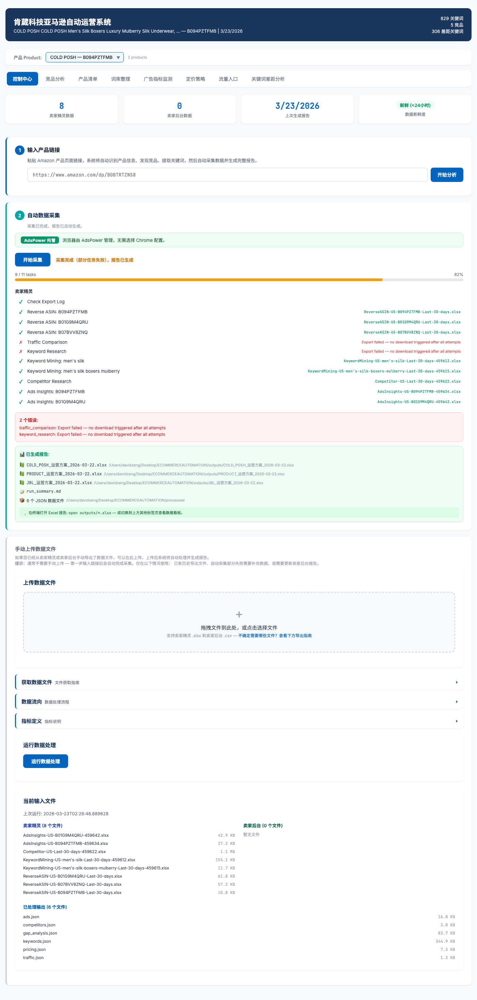

> 💡 **提示**：首次打开时，如果尚未采集数据，各标签页会显示为空或提示"暂无数据"。这是正常的。

### 5.4 认识控制中心

控制中心是系统的核心操作页面，顶部显示关键统计信息和产品选择器：

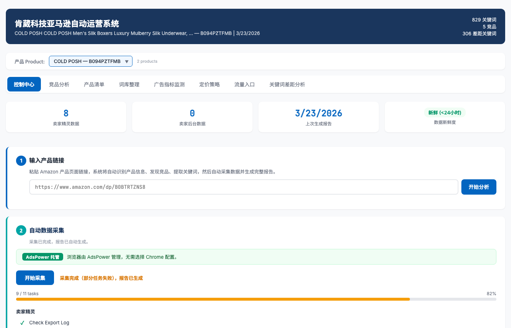

页面从上到下依次是：
1. **顶部导航栏** — 包含系统标题和标签页切换
2. **统计卡片** — 显示文件数量、报告日期等关键指标
3. **产品选择器** — 切换和管理不同产品
4. **操作区域** — 输入链接、采集数据、手动上传

### 5.5 输入产品链接

1. 在控制中心页面中找到 **"输入产品链接"** 输入框
2. 粘贴一个 Amazon 产品链接，例如：
   ```
   https://www.amazon.com/dp/B094PZTFMB
   ```
   或者直接输入 ASIN 编号：`B094PZTFMB`
3. 点击 **"开始分析"** 按钮

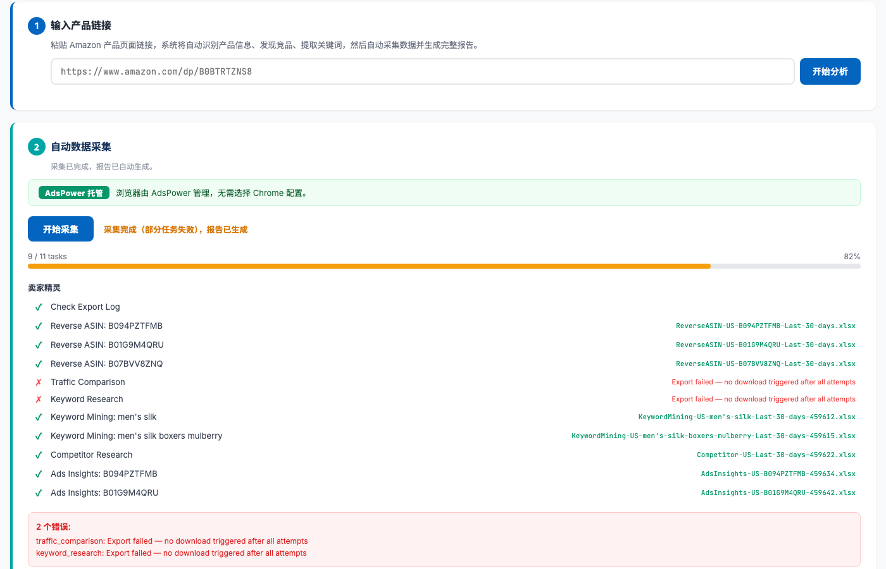

### 5.6 等待产品发现

系统会自动执行以下操作（大约 30-60 秒）：

1. ✅ 解析 Amazon 产品页面，获取产品标题、品牌、价格、分类等信息
2. ✅ 自动发现 4 个主要竞争对手
3. ✅ 根据产品类别自动生成种子关键词
4. ✅ 将产品添加到多产品管理列表中
5. ✅ 自动配置采集参数（反查 ASIN 列表、对比 ASIN 列表等）

你可以在控制中心看到产品信息逐步填充的过程。

> 💡 **提示**：产品发现使用 Playwright 浏览器自动化技术，会在后台打开一个隐藏的浏览器窗口来获取产品信息。

### 5.7 开始数据采集

产品发现完成后：

1. 控制中心会显示产品的基本信息和竞品列表
2. 点击 **"开始采集"** 按钮
3. 系统会依次执行以下采集任务：

| 任务 | 数据来源 | 说明 |
|------|----------|------|
| 反查 ASIN（ExpandKeywords） | 卖家精灵 | 获取你和竞品的流量关键词 |
| 关键词挖掘（KeywordMining） | 卖家精灵 | 基于种子词扩展关键词库 |
| 流量对比（CompareKeywords） | 卖家精灵 | 对比你与竞品的流量来源 |
| 广告洞察（AdsInsights） | 卖家精灵 | 获取广告关键词排名周度变化 |
| 竞品研究（Competitor） | 卖家精灵 | 获取竞品详细销售和产品信息 |
| 关键词研究（KeywordResearch） | 卖家精灵 | 获取行业热门关键词数据 |

4. 每个任务旁会显示状态图标：
   - ⏳ 等待中
   - 🔄 采集中
   - ✅ 采集完成
   - ❌ 采集失败（可重试）

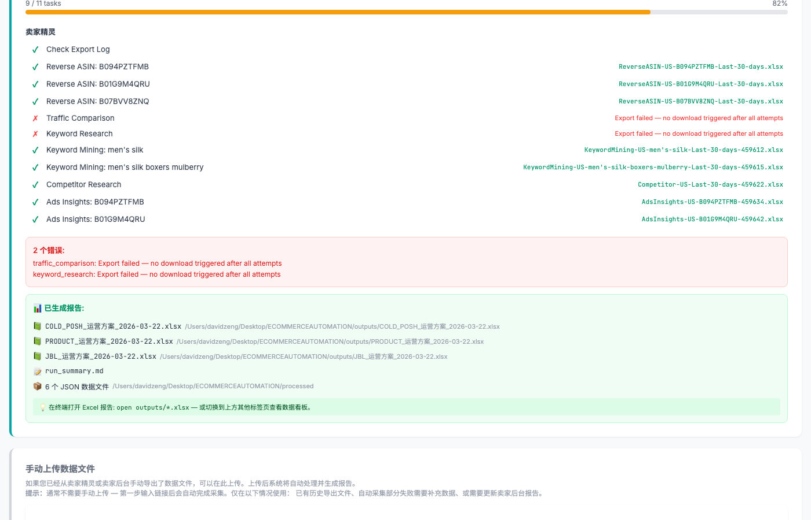

> 💡 **提示**：完整采集过程大约需要 15-30 分钟，取决于数据量和网络速度。采集过程中请不要关闭 AdsPower。

> ⚠️ **注意**：如果某个任务失败（显示 ❌），可以点击该任务旁的"重试"按钮单独重新采集。不需要重新运行全部任务。

### 5.8 数据处理与报告生成

数据采集完成后，系统会自动运行数据处理管道：

1. ✅ 解析所有下载的 .xlsx 和 .csv 文件
2. ✅ 运行关键词处理器 — 合并、去重、分类 800+ 关键词
3. ✅ 运行竞品分析处理器 — 生成对比矩阵
4. ✅ 运行 Gap 分析处理器 — 计算 MISSING/CATCHUP/DEFEND
5. ✅ 运行定价处理器 — 4 种方案利润计算
6. ✅ 运行广告处理器 — 生成周度监测数据
7. ✅ 运行流量处理器 — 生成渠道策略
8. ✅ 生成 Excel 运营报告
9. ✅ 生成 JSON 数据文件供仪表盘使用

生成的文件位置：
- **Excel 报告**：`outputs/` 或 `data/{产品ID}/outputs/`
- **JSON 数据**：`processed/` 或 `data/{产品ID}/processed/`
- **运行摘要**：`outputs/run_summary.md`

### 5.9 查看分析结果

报告生成完成后：

1. 仪表盘会自动刷新数据
2. 点击顶部的各个标签页浏览不同维度的分析结果：
   - **竞品分析** — 查看竞品对比矩阵
   - **产品清单** — 查看成本模型和变体销售
   - **词库整理** — 浏览 800+ 关键词库
   - **广告指标监测** — 查看广告表现趋势
   - **定价策略** — 查看每个变体的成本分解
   - **流量入口** — 查看各渠道运营方案
   - **Gap 分析** — 发现关键词增长机会
3. 也可以直接打开 `outputs/` 目录下的 Excel 文件查看详细数据

✅ **恭喜！你已完成首次使用。** 接下来的章节将详细介绍每个功能。

---

## 第六章：系统界面详解

> 系统的网页仪表盘包含控制中心 + 7 个数据标签页，每个标签页展示不同维度的运营数据。本章逐一介绍各标签页的功能和使用方法。

### 6.1 控制中心 (Control Center)

控制中心是系统的"大脑"，用于管理产品、启动采集、查看整体状态。


#### 顶部状态栏

页面顶部显示关键指标卡片：

| 指标 | 说明 |
|------|------|
| **卖家精灵文件数** | 当前已采集的 SellerSprite .xlsx 文件数量 |
| **卖家后台文件数** | 当前已上传的 Seller Central .csv 文件数量 |
| **上次报告日期** | 最近一次生成运营报告的时间 |
| **数据新鲜度** | 数据距今多久，超过 7 天建议重新采集 |

#### 步骤一：输入产品链接


- 输入框接受 Amazon 产品 URL 或 ASIN
- 系统会自动解析产品信息并发现竞品
- 产品发现完成后，会显示产品卡片（含图片、标题、价格、评分等）
- 支持完整 URL（如 `https://www.amazon.com/dp/B094PZTFMB`）或纯 ASIN（如 `B094PZTFMB`）

#### 步骤二：数据采集

- 显示所有采集任务的列表和状态
- 可以单独重试失败的任务
- 采集完成后自动触发数据处理管道


上图展示了一次完整采集的任务列表。可以看到 9/11 个任务已经完成。每个任务旁边显示状态图标和完成时间。

#### 步骤三：手动上传文件

如果不使用自动采集（AdsPower），可以在此手动上传：


- 拖放 .xlsx 文件到卖家精灵上传区
- 拖放 .csv 文件到卖家后台上传区
- 上传后需要手动点击"运行管道"按钮生成报告
- 系统会自动识别文件类型（通过文件名前缀）

> 💡 **提示**：手动上传适用于以下场景：
> - 没有安装 AdsPower
> - AdsPower 采集失败需要手动补充数据
> - 只有 Seller Central 的 CSV 数据（自动采集不包含 Seller Central）

#### 产品选择器

如果你管理了多个产品，页面头部会显示产品下拉选择器：

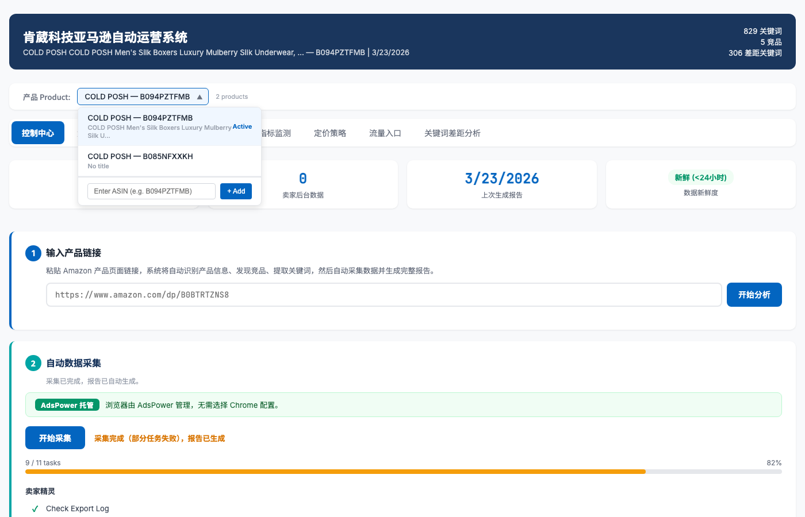

- 点击下拉菜单可以在不同产品之间切换
- 下方显示"添加新 ASIN"输入框，可以快速添加新产品
- 切换产品后，所有标签页的数据会自动更新

### 6.2 竞品分析 (Competitor Analysis)

竞品分析标签页以**纵向对比矩阵**的形式展示你的产品与 4 个竞品的核心指标对比。

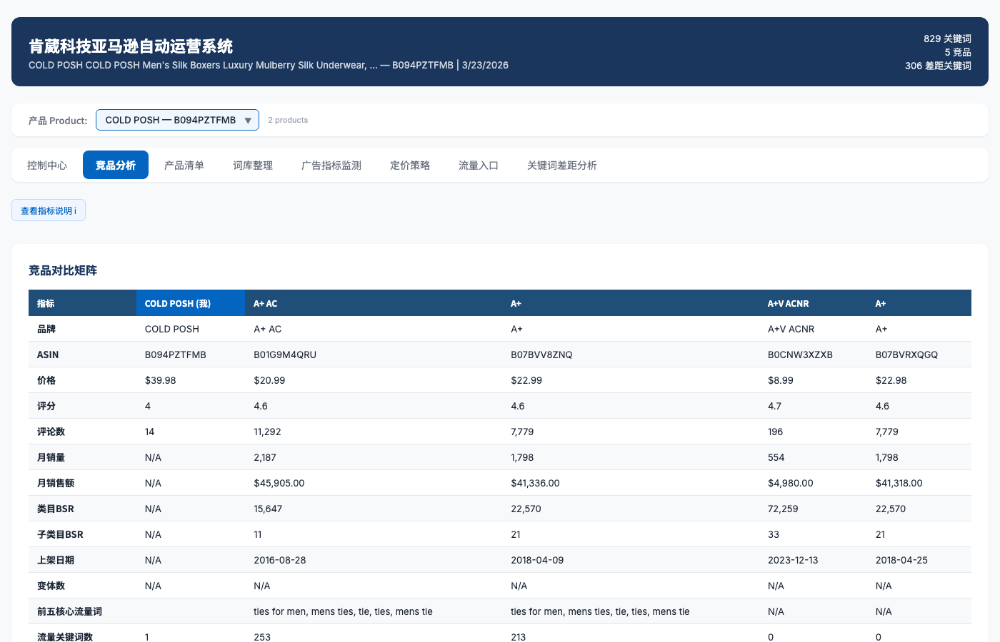

#### 对比指标说明

| 行标签 | 含义 | 数据来源 |
|--------|------|----------|
| **品牌** | 品牌名称 | Competitor Research 报告 |
| **ASIN** | 产品唯一标识符 | Competitor Research 报告 |
| **价格** | 当前售价（美元） | Competitor Research 报告 |
| **排名** | BSR 类目排名 | Competitor Research 报告 |
| **标题** | 产品标题 | Competitor Research 报告 |
| **前五核心流量词** | 搜索量最高的 5 个关键词 | ExpandKeywords 报告 |
| **评论数** | 累计评论数量 | Competitor Research 报告 |
| **月销量** | 预估月销售数量 | Competitor Research 报告 |
| **月销售额** | 预估月销售额（美元） | Competitor Research 报告 |
| **上架日期** | 产品首次上架时间 | Competitor Research 报告 |
| **变体数** | 变体（颜色/尺寸等）数量 | Competitor Research 报告 |
| **FBA 毛利率** | 使用 FBA 配送的预估毛利率 | Competitor Research 报告 |
| **流量关键词数** | 产品获得流量的关键词总数 | ExpandKeywords 报告 |

#### 如何解读数据

- 📊 关注与竞品的**价格差距**：定价是否具有竞争力
- 📊 对比**评论数**：评论数量直接影响转化率，差距大时需要加大运营力度
- 📊 对比**月销量**：了解市场份额差距
- 📊 重点关注**前五核心流量词**：了解竞品的主要流量来源，发现可能遗漏的关键词
- 📊 对比**流量关键词数**：关键词覆盖面是否有差距

### 6.3 产品清单 (Product List / Pricing Model)

产品清单标签页分为两个部分：**成本模型**和**变体销售数据**。

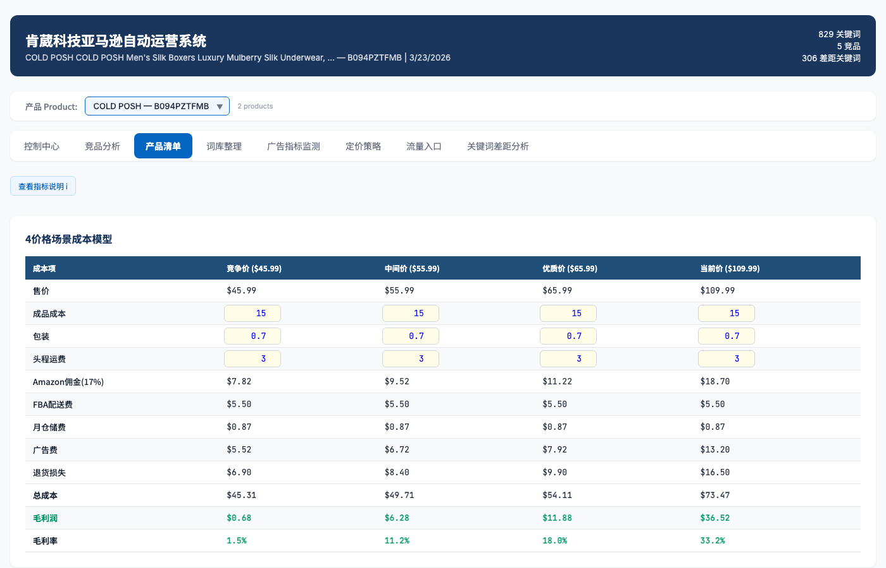

#### 部分 A：成本模型（4 种定价方案）

系统自动计算 4 种价格方案下的成本和利润：

| 方案 | 默认价格 | 适用场景 |
|------|----------|----------|
| **竞争价** | $45.99 | 低价竞争策略，快速抢占市场份额 |
| **中间价** | $55.99 | 平衡策略，兼顾利润和竞争力 |
| **优质价** | $65.99 | 品质定位策略，追求更高利润 |
| **当前价** | $109.99（以实际为准） | 当前实际售价，对标现状 |

> 💡 **提示**：价格方案可以在 config.json 的 `pricing_scenarios` 中自定义修改。

每种方案下的成本明细：

| 成本项 | 说明 |
|--------|------|
| 成品成本 | 单位采购/生产成本 |
| 包装 | 包装材料费 |
| 头程运费 | 从工厂运到亚马逊仓库的运费 |
| Amazon 佣金（17%） | 亚马逊平台销售佣金（自动按售价计算） |
| FBA 配送费 | 亚马逊物流配送费用 |
| 月仓储费 | 月度仓储费用 |
| 广告费（CPA） | 单次转化的广告成本 |
| 退货损失 | 预估退货产生的损失 |
| **总成本** | 以上所有成本之和 |
| **毛利润** | 售价 - 总成本 |
| **毛利率** | 毛利润 / 售价 |

> 💡 **提示**：**蓝色文字 + 黄色背景** 的单元格是可编辑的！你可以根据实际情况修改成本数据（如成品成本、包装费、头程运费等），系统会自动重新计算利润和毛利率。

#### 部分 B：变体销售数据

显示每个子 ASIN（如不同颜色/尺寸）的销售数据：
- 访客数（Sessions）
- 转化率（CVR）
- 收入（Revenue）

> ⚠️ **注意**：此部分数据需要上传 Seller Central 的 Business Report CSV 文件才能显示。如果没有上传，会显示为空。

### 6.4 词库整理 (Keyword Library)

词库整理是系统最核心的功能之一，汇总了来自多个数据源的关键词并自动分类。

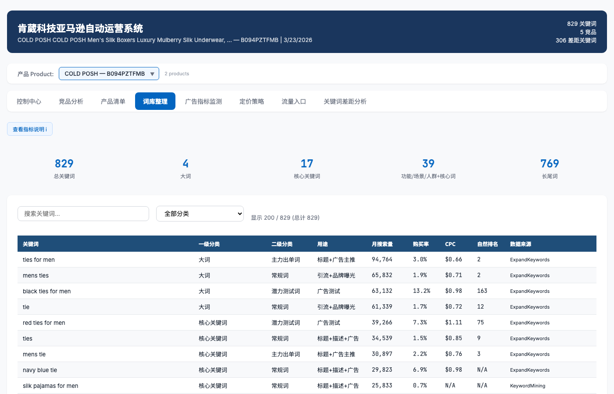

#### 关键词数量

系统通常会整合 **800+** 个关键词（取决于产品类目和采集范围），全部自动去重并分类。上图展示了 829 个关键词的词库。

#### 一级分类（按搜索量）

| 分类 | 条件 | 说明 |
|------|------|------|
| **大词** | 月搜索量 > 50,000 | 行业大词，竞争极其激烈，难以快速获取排名 |
| **核心关键词** | 月搜索量 10,000 ~ 50,000 | 核心流量词，重点优化对象 |
| **功能/场景/人群+核心词** | 月搜索量 3,000 ~ 10,000 | 中等精准词，性价比高，推荐重点投放 |
| **长尾词** | 月搜索量 < 3,000 或词数 >= 4 | 精准长尾词，转化率通常较高 |
| **竞品品牌词** | 包含竞品品牌名 | 竞品品牌相关搜索词（如 lilysilk、chigant 等） |

#### 二级分类（按表现）

| 分类 | 条件 | 运营建议 |
|------|------|----------|
| **主力出单词** | 购买率 > 2% 且自然排名前 20 | 🟢 重点维护，确保排名稳定，加大预算 |
| **潜力测试词** | 月搜索量 > 5,000 且自然排名 > 50 | 🟡 值得投入广告测试，观察转化效果 |
| **流量词/防御词** | 月搜索量 > 10,000 且购买率 < 0.5% | 🟠 引流用，注意广告 ROI，控制出价 |
| **无效词/亏损词** | 无购买、无排名且 PPC 出价 > $2.00 | 🔴 建议暂停投放，避免浪费预算 |

#### 列含义

| 列名 | 说明 |
|------|------|
| 关键词 | 搜索关键词 |
| 一级分类 | 按搜索量分级 |
| 二级分类 | 按运营表现分级 |
| 月搜索量 | 该关键词每月被搜索的次数 |
| 搜索频率排名 | 在 Amazon 搜索词中的排名（ABA Rank） |
| 购买率 | 搜索该词后实际购买的比例 |
| CPC | 每次点击广告的费用（美元） |
| CPA | 每次转化的广告成本（美元） |
| 自然排名 | 你的产品在自然搜索中的排名 |
| 广告排名 | 你的产品在广告位中的排名 |
| 数据来源 | 该关键词来自哪个报告（ExpandKeywords、KeywordMining 等） |

#### 搜索和筛选

页面提供搜索框，可以快速搜索特定关键词。输入关键词后会实时过滤结果。

### 6.5 广告指标监测 (Ads Monitoring)

广告监测标签页展示广告搜索词的表现数据和趋势。

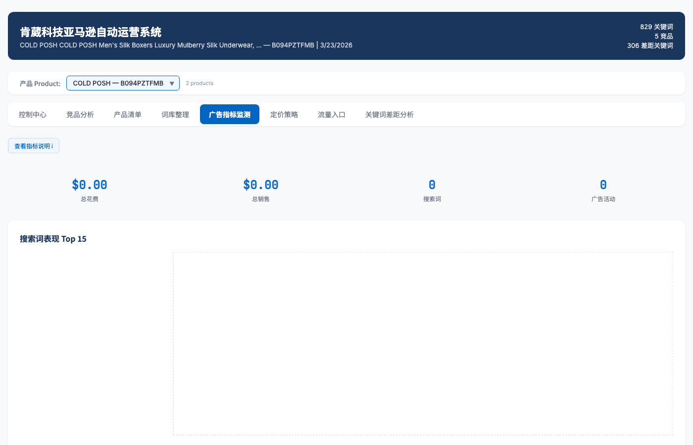

#### 数据内容

- **搜索词表现**：展示各搜索词的曝光、点击、花费、订单、ACoS 等指标
- **周度趋势**：按周追踪关键词排名变化（来自 AdsInsights 数据）

#### 数据来源

| 数据 | 来源 |
|------|------|
| 排名和周度变化 | SellerSprite AdsInsights 导出 |
| 搜索词表现 | Seller Central SpSearchTerm 报告 |
| 活动汇总 | Seller Central SpCampaign 报告 |

#### 广告活动汇总

页面下方还会显示广告活动的汇总数据（需要上传 Seller Central 的广告报告 CSV）：
- 总花费
- 总销售额
- 平均 ACoS
- 平均 CPC

> ⚠️ **注意**：如果没有上传 Seller Central 的广告报告（SpSearchTerm 和 SpCampaign CSV），此标签页的部分数据会显示为空。AdsInsights 数据由自动采集获取。

### 6.6 定价策略 (Pricing Strategy)

定价策略标签页展示每个变体（子 ASIN）的详细成本分解。

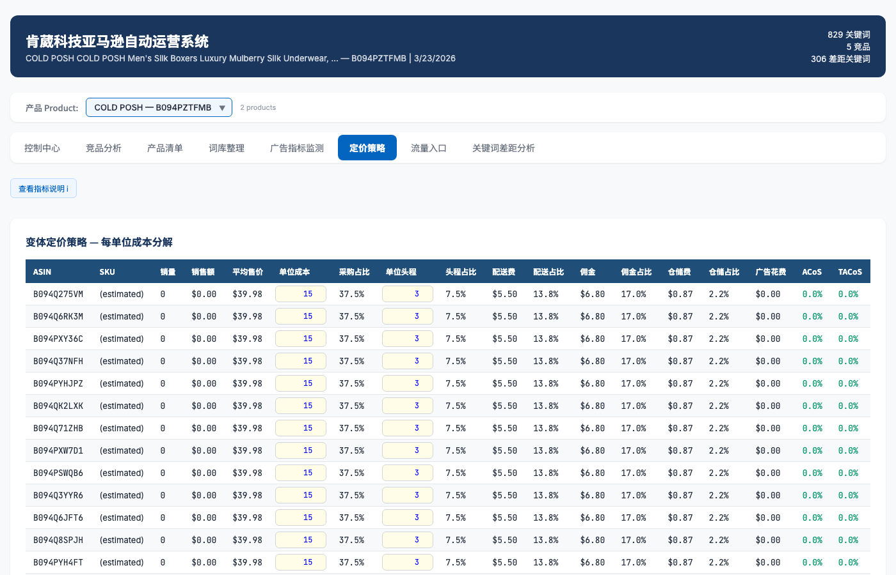

#### 列说明

| 列名 | 说明 |
|------|------|
| ASIN | 子 ASIN |
| MSKU | 商家 SKU |
| 销量 | 该变体的销售数量 |
| 销售额 | 该变体的销售金额 |
| 平均售价 | 销售额 / 销量 |
| 单位成本 | 每件成品的采购成本 |
| 采购占比 | 单位成本 / 平均售价 |
| 单位头程 | 每件的头程运费 |
| 头程占比 | 单位头程 / 平均售价 |
| 单位配送费 | FBA 每件配送费 |
| 配送费占比 | 单位配送费 / 平均售价 |
| 类目佣金 | Amazon 17% 佣金 |
| 佣金占比 | 佣金 / 平均售价 |
| 月仓储费 | 月度仓储费 |
| 月仓储费占比 | 月仓储费 / 平均售价 |
| 广告花费 | 广告总花费 |
| ACoS | 广告成本销售比（Advertising Cost of Sales） |
| TACoS | 总广告成本销售比（Total ACoS） |

> 💡 **提示**：所有"占比"列的数值都是通过 Excel 公式自动计算的（成本项 / 平均售价），修改成本后会自动更新。

> ⚠️ **注意**：此标签页需要 Business Report CSV、FBA Fee Preview CSV 和 Campaign Report CSV 三个数据源才能显示完整数据。如果数据不全，系统会使用 config.json 中 `cost_inputs` 的预估值填充。

### 6.7 流量入口 (Traffic Sources)

流量入口标签页以策略矩阵的形式展示各流量渠道的运营方案。

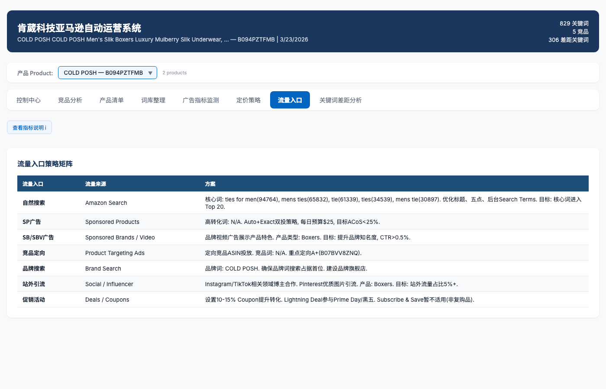

#### 流量渠道

| 流量入口 | 流量来源 | 方案说明 |
|----------|----------|----------|
| **自然搜索** | Amazon SEO | 优化标题、Bullet Points、后台关键词，重点布局核心词 |
| **SP 广告** | Sponsored Products | 精准匹配核心出单词，广泛匹配挖掘新词 |
| **SB/SBV 广告** | Sponsored Brands / Video | 品牌展示广告，提升品牌认知 |
| **竞品定向** | Product Targeting | 定向投放竞品 ASIN 的产品页面 |
| **品牌搜索** | Brand Search | 品牌关键词防御 |
| **站外引流** | External Traffic | 社交媒体、博客、红人合作等 |
| **促销活动** | Deals & Coupons | Lightning Deal、Coupon、Prime Day 等 |

#### 特色功能

系统会自动将词库中的**真实关键词和搜索量数据**填充到方案的"建议关键词"列中，帮助你快速制定广告投放计划。不是泛泛的建议，而是基于你实际产品数据生成的具体推荐。

### 6.8 关键词差距分析 (Gap Analysis)

关键词差距分析是找到**增长机会**的关键工具。它将你的产品与主要竞品的关键词进行交叉对比。

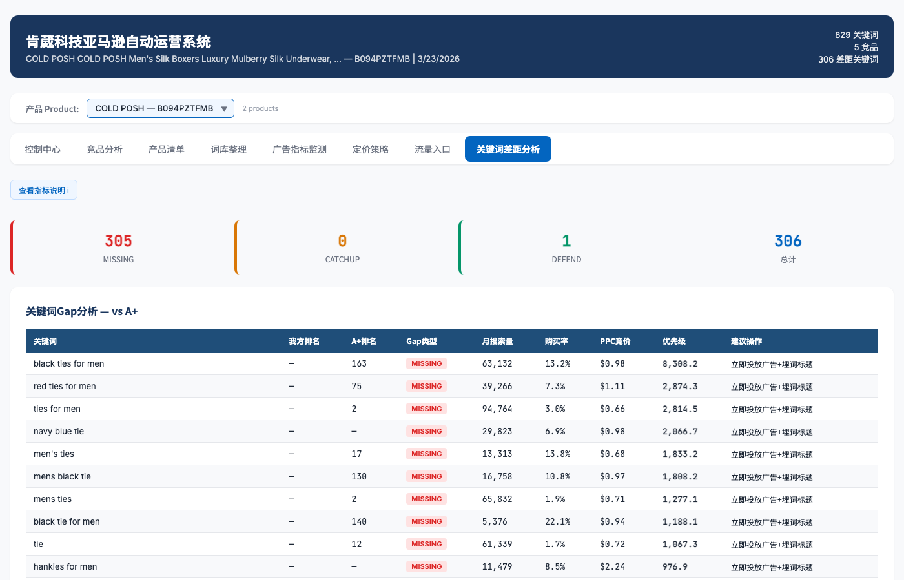

#### 三种差距类型

| 类型 | 颜色标记 | 含义 | 优先级 |
|------|----------|------|--------|
| **MISSING**（缺失） | 🔴 红色 | 竞品有排名但你**没有排名**的关键词 | 最高 — 全新增长机会 |
| **CATCHUP**（追赶） | 🟠 橙色 | 你和竞品都有排名，但**竞品排名更靠前** | 中等 — 需要提升 |
| **DEFEND**（防守） | 🟢 绿色 | 你排名比竞品靠前，需要**维护优势** | 较低 — 保持现状 |

#### 列说明

| 列名 | 说明 |
|------|------|
| keyword | 关键词 |
| my_rank | 你的排名（无排名显示为 "--"） |
| competitor_rank | 竞品排名 |
| gap_type | MISSING / CATCHUP / DEFEND |
| monthly_searches | 月搜索量 |
| purchase_rate | 购买率 |
| ppc_bid | PPC 建议出价 |
| priority_score | 优先级评分（自动计算） |
| recommended_action | 建议操作（中文） |

#### 优先级评分计算方式

```
优先级评分 = 月搜索量 × 购买率 × 权重系数
```

权重系数：
- **MISSING（缺失词）**：1.0（最高权重——这些是全新的增长机会）
- **CATCHUP（追赶词）**：0.5
- **DEFEND（防守词）**：0.2

> 💡 **提示**：重点关注 MISSING 类型中**优先级评分最高**的关键词，这些是你最应该优先开拓的新流量来源。可以将这些词加入 SP 广告的精准匹配广告组进行测试。

---

## 第七章：多产品管理

> 系统支持同时管理多个 Amazon 产品，每个产品有独立的数据和报告。

### 7.1 产品选择器

在仪表盘顶部的导航栏中，你会看到一个**产品下拉选择器**。点击它可以在不同产品之间切换。


上图展示了产品选择器打开的状态，可以看到已经添加了 2 个产品，下方还有"添加新 ASIN"输入框。

### 7.2 添加新产品

**方法一：通过仪表盘（推荐）**

1. 在控制中心标签页，找到产品选择器下方的"添加新 ASIN"输入框
2. 粘贴新产品的 Amazon 链接或 ASIN
3. 点击"添加"按钮
4. 系统会自动发现产品信息和竞品
5. 新产品会出现在产品选择器中

**方法二：通过命令行**

使用 `config_manager.py` 脚本管理产品：

```bash
cd ~/Desktop/ECOMMERCEAUTOMATION

# 创建新产品
python3 scripts/config_manager.py create B094PZTFMB "COLD POSH"

# 查看所有产品
python3 scripts/config_manager.py list

# 查看当前活跃产品
python3 scripts/config_manager.py active

# 切换活跃产品
python3 scripts/config_manager.py set-active B094PZTFMB

# 查看产品目录路径
python3 scripts/config_manager.py paths B094PZTFMB
```

**方法三：运行指定产品的管道**

```bash
python3 scripts/generate_report.py --product-id B094PZTFMB
```

将 `B094PZTFMB` 替换为你要分析的产品 ASIN。

### 7.3 切换产品

点击页面顶部的产品选择器下拉菜单，选择你要查看的产品即可。切换后，所有标签页的数据会自动更新为该产品的数据。

### 7.4 数据隔离

每个产品的数据是**完全隔离**的：

```
data/
├── products.json                  ← 产品索引文件
│
├── B094PZTFMB/                    ← 产品 A（Men's Silk Boxers）
│   ├── config.json                ← 该产品的独立配置
│   ├── inputs/
│   │   ├── sellersprite/          ← 该产品的卖家精灵数据
│   │   └── seller-central/        ← 该产品的卖家后台数据
│   ├── processed/                 ← 该产品的 JSON 数据
│   ├── outputs/                   ← 该产品的 Excel 报告
│   └── logs/                      ← 该产品的日志
│
├── B0BTRTZNS8/                    ← 产品 B（Women's Silk Blouse）
│   ├── config.json
│   ├── inputs/
│   ├── processed/
│   └── outputs/
│
└── _archived/                     ← 已归档的产品（删除时自动移入）
```

这意味着不同产品的数据不会相互干扰。每个产品都有自己独立的：
- 配置文件（config.json）
- 输入数据（inputs/）
- 处理结果（processed/）
- 输出报告（outputs/）
- 运行日志（logs/）

### 7.5 产品管理命令大全

| 命令 | 说明 |
|------|------|
| `python3 scripts/config_manager.py list` | 列出所有产品及其状态 |
| `python3 scripts/config_manager.py create <ASIN> [品牌名]` | 创建新产品 |
| `python3 scripts/config_manager.py active` | 查看当前活跃产品 |
| `python3 scripts/config_manager.py set-active <ASIN>` | 设置活跃产品 |
| `python3 scripts/config_manager.py paths <ASIN>` | 查看产品的所有目录路径 |
| `python3 scripts/config_manager.py delete <ASIN>` | 归档删除产品（可恢复） |
| `python3 scripts/config_manager.py delete <ASIN> --no-archive` | 永久删除产品（不可恢复） |
| `python3 scripts/config_manager.py migrate` | 将旧版平面目录结构迁移到多产品模式 |

> 💡 **提示**：`delete` 命令默认使用归档模式，会将产品目录移到 `data/_archived/` 下，不会真正删除数据。如果确定不再需要，使用 `--no-archive` 参数永久删除。

### 7.6 从旧版迁移到多产品模式

如果你之前使用的是旧版（数据直接放在 `inputs/` 和 `outputs/` 目录），可以使用迁移命令：

```bash
python3 scripts/config_manager.py migrate
```

迁移会：
1. 读取根目录的 `config.json`，获取当前活跃产品 ASIN
2. 在 `data/{ASIN}/` 下创建完整目录结构
3. 将 `inputs/`、`processed/`、`outputs/` 中的文件**复制**到新位置
4. 设置该产品为活跃产品
5. 更新产品统计信息

> ⚠️ **注意**：迁移是**复制**操作，不会删除原目录中的文件。迁移完成后，你可以手动删除旧文件。

---

## 第八章：Excel 报告使用指南

> 系统生成的 Excel 报告是运营决策的核心文档。本章介绍如何正确使用它。

### 8.1 如何打开 Excel 文件

Excel 报告保存在以下位置：

- 默认位置：`outputs/COLD_POSH_运营方案_YYYY-MM-DD.xlsx`
- 多产品模式：`data/{ASIN}/outputs/运营方案_YYYY-MM-DD.xlsx`

双击文件即可用 Microsoft Excel 或 WPS Office 打开。

> 💡 **提示**：推荐使用 **Microsoft Excel** 打开，以获得最佳的格式兼容性（条件格式、冻结窗格等）。macOS 用户可以使用 Numbers，但部分格式可能显示不同。WPS Office 兼容性也不错。

### 8.2 8 个标签页概览

打开文件后，底部会显示 8 个标签页（Sheet）：

| 编号 | 标签名 | 内容 |
|------|--------|------|
| 1 | **竞品分析** | 你与 4 个竞品的核心指标纵向对比 |
| 2 | **产品清单** | 4 种定价方案的成本模型 + 变体销售数据 |
| 3 | **词库整理** | 800+ 关键词分类库，包含搜索量、购买率等详细指标 |
| 4 | **广告指标监测** | 关键词广告表现的周度追踪热力图 |
| 5 | **定价策略** | 每个变体 ASIN 的成本分解表 |
| 6 | **流量入口** | 各流量渠道的运营方案 |
| 7 | **关键词Gap分析** | MISSING / CATCHUP / DEFEND 关键词差距分析 |
| 8 | **数据源日志** | 本次分析使用的所有数据文件记录 |

### 8.3 可编辑单元格

Excel 报告中有一些单元格是**可编辑**的，你可以根据实际情况修改。

**识别方法**：可编辑单元格使用 **蓝色文字（#0000FF）+ 黄色背景（#FFFF00）**。

主要的可编辑项：

| 标签页 | 可编辑项 | 说明 |
|--------|----------|------|
| 产品清单 | 成品成本、包装费、头程运费、广告费、退货损失等 | 修改后利润和毛利率会自动重新计算 |
| 定价策略 | 单位成本、头程运费等 | 各占比会自动更新 |

> 💡 **提示**：修改可编辑单元格后，只需按回车键确认，所有关联的公式会自动重新计算。

### 8.4 公式说明

> ⚠️ **极其重要**：不要删除或覆盖含有公式的单元格！

报告中大量使用 Excel 公式进行自动计算，例如：
- `=B3*0.17` — 计算 17% 的 Amazon 佣金
- `=SUM(B3:B10)` — 计算总成本
- `=(B2-B11)/B2` — 计算毛利率

如果你不小心删除了公式：
1. 按 `Ctrl + Z`（Mac: `Command + Z`）撤销
2. 如果无法撤销，可以重新运行管道生成新的报告：
   ```bash
   cd ~/Desktop/ECOMMERCEAUTOMATION
   python3 scripts/generate_report.py
   ```

### 8.5 条件格式

关键词 Gap 分析标签页使用了条件格式来直观标记不同类型的关键词：

| 颜色 | 含义 |
|------|------|
| 🔴 红色背景 | MISSING — 缺失词，最需要关注 |
| 🟠 橙色背景 | CATCHUP — 追赶词，需要提升排名 |
| 🟢 绿色背景 | DEFEND — 防守词，需要维护现有优势 |

### 8.6 Excel 样式规范

Excel 报告遵循以下统一样式（可在 config.json 的 `styling` 部分修改）：

| 元素 | 样式 |
|------|------|
| 表头 | 深蓝底色（#1F4E79）、白色粗体 Arial 11pt |
| 正文 | Arial 10pt、深灰色文字（#2C3E50） |
| 交替行 | 白色 / 浅灰色（#F2F2F2）交替 |
| 边框 | 浅灰色细线（#BFBFBF） |
| 可编辑单元格 | 蓝色文字（#0000FF）+ 黄色背景（#FFFF00） |
| 冻结窗格 | 表头行冻结，滚动时始终可见 |

### 8.7 打印和分享建议

- **打印**：建议在"页面布局"中设置为横向打印，缩放至适合页面宽度
- **分享**：可直接发送 .xlsx 文件，接收者用 Excel 打开即可看到完整格式
- **导出 PDF**：如果需要 PDF 版本，在 Excel 中选择 `文件` → `导出` → `PDF`

### 8.8 数据源日志（第 8 个标签页）

数据源日志标签页自动记录了本次分析使用的所有数据文件：

| 列名 | 说明 |
|------|------|
| 时间戳 | 文件处理时间 |
| 文件名 | 源数据文件名 |
| 来源类型 | SellerSprite / Seller Central |
| 模块 | 解析模块（ExpandKeywords、KeywordMining 等） |
| 记录数 | 文件中的数据行数 |
| 输出标签页 | 数据被使用在哪些标签页 |
| 数据质量 | 数据质量评估 |
| 备注 | 特殊说明 |

> 💡 **提示**：如果某个标签页的数据看起来不对，可以查看数据源日志确认是否使用了正确的输入文件。

---

## 第九章：手动数据采集（不使用 AdsPower）

> 如果你不想使用 AdsPower 自动采集，或者自动采集出现问题，可以按照本章手动从网站导出数据。

### 9.1 从卖家精灵导出

打开浏览器，访问 https://www.sellersprite.com 并登录。

#### 导出 1：反查 ASIN（ExpandKeywords）

1. 进入 **关键词** → **反查ASIN** 功能
2. 输入你的产品 ASIN（如 `B094PZTFMB`）
3. 选择市场为 **US**
4. 点击搜索
5. 结果显示后，点击右上角的 **导出** 按钮
6. 下载得到 `ExpandKeywords-US-B094PZTFMB-xxx.xlsx` 文件
7. **对每个竞品 ASIN 也重复以上操作**

> ⚠️ **重要**：需要为你的产品和每个竞品分别导出一份。例如，如果有 4 个竞品，总共需要导出 5 份 ExpandKeywords 文件。

#### 导出 2：关键词挖掘（KeywordMining）

1. 进入 **关键词** → **关键词挖掘** 功能
2. 输入种子关键词（如 `men's silk boxers`）
3. 选择 **US** 市场，时间范围 **Last 30 days**
4. 点击搜索，等待结果
5. 点击 **导出**
6. 下载得到 `KeywordMining-US-xxx.xlsx` 文件

> 💡 **提示**：可以多次使用不同的种子关键词导出（如 `silk boxers`、`men's silk underwear`），系统会自动合并去重。

#### 导出 3：流量对比（CompareKeywords）

1. 进入 **关键词** → **流量对比** 功能
2. 输入你的 ASIN 和竞品 ASIN（最多 5 个）
3. 点击搜索
4. 点击 **导出**
5. 下载得到 `CompareKeywords-US-xxx.xlsx` 文件

#### 导出 4：广告洞察（AdsInsights）

1. 进入 **关键词** → **广告洞察** 功能
2. 输入你的 ASIN
3. 查看结果
4. 点击 **导出**
5. 下载得到 `AdsInsights-US-xxx.xlsx` 文件

> ⚠️ **注意**：AdsInsights 文件有特殊的**透视表（Pivot）格式**，系统会自动处理。请不要手动修改导出的文件。

#### 导出 5：竞品研究（Competitor）

1. 进入 **产品** → **竞品研究** 功能
2. 输入目标关键词（如 `men's silk boxers`）
3. 选择 **US** 市场
4. 点击搜索
5. 点击 **导出**
6. 下载得到 `Competitor-US-xxx.xlsx` 文件

#### 导出 6：关键词研究（KeywordResearch）

1. 进入 **关键词** → **关键词研究** 功能
2. 查看当前月度的关键词数据
3. 点击 **导出**
4. 下载得到 `KeywordResearch-US-xxx.xlsx` 文件

### 9.2 从 Seller Central 导出

登录 Amazon Seller Central（https://sellercentral.amazon.com）。

> 💡 **提示**：Seller Central 的数据是可选的。如果你只需要关键词分析和竞品对比，可以跳过此部分。Seller Central 数据主要影响"定价策略"和"广告指标监测"标签页。

#### 导出 1：Business Report

1. 进入 **报告** → **业务报告** → **按 ASIN - 子商品详情页面的销量和访问量**
2. 选择日期范围（建议最近 30 天）
3. 点击 **下载**（CSV 格式）
4. 下载得到 `BusinessReport-xxx.csv` 文件

#### 导出 2：Search Term Report（广告搜索词报告）

1. 进入 **广告** → **广告活动管理器**
2. 在左侧菜单点击 **报告**
3. 选择报告类型：**搜索词**
4. 选择日期范围
5. 点击 **创建报告**，等待生成后下载
6. 下载得到 `SpSearchTerm-xxx.csv` 文件

#### 导出 3：Campaign Report（广告活动报告）

1. 同样在 **广告** → **报告** 页面
2. 选择报告类型：**广告活动**
3. 选择日期范围
4. 下载得到 `SpCampaign-xxx.csv` 文件

#### 导出 4：FBA Fee Preview（FBA 费用预览）

1. 进入 **报告** → **配送报告** → **FBA 费用预览**
2. 点击 **下载报告**
3. 下载得到 `FBAFee-xxx.csv` 文件

### 9.3 放置文件到正确目录

将下载的文件按以下规则放置：

**单产品模式：**

```
inputs/
├── sellersprite/           ← 所有 .xlsx 文件放在这里
│   ├── ExpandKeywords-US-B094PZTFMB-xxx.xlsx
│   ├── ExpandKeywords-US-B01G9M4QRU-xxx.xlsx    ← 竞品的也要放
│   ├── KeywordMining-US-xxx.xlsx
│   ├── CompareKeywords-US-xxx.xlsx
│   ├── AdsInsights-US-xxx.xlsx
│   ├── Competitor-US-xxx.xlsx
│   └── KeywordResearch-US-xxx.xlsx
│
└── seller-central/         ← 所有 .csv 文件放在这里
    ├── BusinessReport-xxx.csv
    ├── SpSearchTerm-xxx.csv
    ├── SpCampaign-xxx.csv
    └── FBAFee-xxx.csv
```

**多产品模式：**

```
data/{ASIN}/inputs/
├── sellersprite/           ← 该产品的 .xlsx 文件
└── seller-central/         ← 该产品的 .csv 文件
```

> ⚠️ **重要**：**文件名前缀必须正确**！系统通过文件名前缀来识别文件类型。不要重命名下载的文件，卖家精灵和 Seller Central 导出的文件名默认就是正确的格式。

文件名前缀对照表：

| 前缀 | 文件类型 |
|------|----------|
| `ExpandKeywords-` | 反查 ASIN 报告 |
| `KeywordMining-` | 关键词挖掘报告 |
| `CompareKeywords-` | 流量对比报告 |
| `AdsInsights-` | 广告洞察报告 |
| `Competitor-` | 竞品研究报告 |
| `KeywordResearch-` | 关键词研究报告 |
| `BusinessReport` | 业务报告 |
| `SpSearchTerm` | 搜索词报告 |
| `SpCampaign` | 活动报告 |
| `FBAFee` | FBA 费用报告 |

### 9.4 通过仪表盘上传

除了手动将文件放到目录中，你也可以通过仪表盘的控制中心进行拖拽上传：


1. 打开仪表盘（`http://localhost:3000`）
2. 在控制中心找到"手动上传"区域
3. 将 .xlsx 文件拖到"卖家精灵文件"上传区
4. 将 .csv 文件拖到"卖家后台文件"上传区
5. 上传完成后，点击"运行管道"按钮

### 9.5 运行数据处理管道

文件放置完成后，运行以下命令生成报告：

```bash
cd ~/Desktop/ECOMMERCEAUTOMATION
python3 scripts/generate_report.py
```

等待处理完成（通常 10-30 秒），然后在 `outputs/` 目录下查看生成的 Excel 报告。

如果是多产品模式，指定产品 ID：

```bash
python3 scripts/generate_report.py --product-id B094PZTFMB
```

> 💡 **提示**：你也可以通过仪表盘的控制中心手动上传文件后，点击"运行管道"按钮。效果完全一样。

---

## 第十章：配置文件详解（config.json）

> `config.json` 是系统的核心配置文件，位于项目根目录。本章逐一解释每个配置项的含义。

### 10.1 文件位置

```
~/Desktop/ECOMMERCEAUTOMATION/config.json
```

用任何文本编辑器打开即可修改。修改后保存文件，下次运行管道时将使用新配置。

> ⚠️ **注意**：请确保 JSON 格式正确。常见格式错误包括：
> - 缺少逗号（两个字段之间必须有逗号）
> - 多余的逗号（最后一个字段后不能有逗号）
> - 引号不成对（每个字符串值都必须用双引号包裹）
> - 可以使用在线 JSON 校验工具检查格式：https://jsonlint.com/

### 10.2 store — 店铺信息

```json
"store": {
    "name": "COLD POSH",
    "url": "https://www.amazon.com/stores/COLDPOSH/page/C28EB97E-1B2E-497C-B8B9-DD068BE581E6",
    "established": 2008,
    "niche": "Premium 100% Mulberry Silk Clothing & Sleepwear",
    "product_lines": [
        "Women's Silk Blouses",
        "Women's Silk Pajama Sets",
        "Men's Silk Pajama Sets",
        "Men's Silk Boxers",
        "Silk Robes/Bathrobes"
    ]
}
```

| 字段 | 说明 |
|------|------|
| `name` | 店铺名称 |
| `url` | Amazon 店铺页面链接 |
| `established` | 店铺创建年份 |
| `niche` | 店铺定位/细分市场 |
| `product_lines` | 产品线列表 |

> 💡 **提示**：店铺信息主要用于报告标题和品牌标识，不影响数据分析。

### 10.3 active_product — 当前活跃产品

```json
"active_product": {
    "asin_parent": "B094PZTFMB",
    "asin_listing": "B094PZTFMB",
    "brand": "COLD POSH",
    "title": "COLD POSH Men's Silk Boxers Luxury Mulberry Silk Underwear...",
    "url": "https://www.amazon.com/dp/B094PZTFMB",
    "category": "Clothing, Shoes & Jewelry > Men > Clothing > Underwear > Boxers",
    "current_price": 39.98,
    "rating": 4.0,
    "review_count": 14,
    "child_asins": ["B094Q275VM", "B094Q6RK3M", "B094PXY36C", ...],
    "image_url": "https://m.media-amazon.com/images/I/71e0qEjxUIL._AC_SX679_.jpg"
}
```

| 字段 | 说明 |
|------|------|
| `asin_parent` | 父 ASIN（多变体产品的主 ASIN） |
| `asin_listing` | Listing 主 ASIN |
| `brand` | 品牌名 |
| `title` | 产品标题 |
| `url` | Amazon 产品页面链接 |
| `category` | 产品分类路径 |
| `current_price` | 当前售价（美元） |
| `rating` | 产品评分 |
| `review_count` | 评论数 |
| `child_asins` | 所有子 ASIN 列表（不同颜色/尺寸） |
| `image_url` | 产品主图链接 |

> 💡 **提示**：使用仪表盘"产品发现"功能时，这些字段会自动填充，不需要手动修改。

### 10.4 competitors — 竞品信息

```json
"competitors": {
    "C1": {
        "asin": "B01G9M4QRU",
        "brand": "...",
        "title": "...",
        "price": 5.17,
        "rating": null,
        "note": "Auto-discovered competitor"
    },
    "C2": { "asin": "B07BVV8ZNQ", ... },
    "C3": { "asin": "B0CNW3XZXB", ... },
    "C4": { "asin": "B07BVRXQGQ", ... }
}
```

系统支持最多 4 个竞品（C1 ~ C4）。使用产品发现功能时会自动填充，也可以手动修改 ASIN。

> 💡 **提示**：`note` 字段中标记 `"Auto-discovered competitor"` 表示这是系统自动发现的竞品。你可以手动替换为更合适的竞品 ASIN。

### 10.5 cost_inputs — 成本数据

```json
"cost_inputs": {
    "unit_cost_usd": 15.0,
    "packaging_cost": 0.5,
    "labeling_cost": 0.2,
    "inbound_shipping_per_unit": 3.0,
    "referral_fee_rate": 0.17,
    "fba_fee_estimate": 5.5,
    "monthly_storage_estimate": 0.87,
    "ppc_rate": 0.12,
    "promo_rate": 0.05,
    "return_rate": 0.15,
    "tariff_rate": 0.0,
    "package_dimensions_inches": "12 x 9 x 1",
    "package_weight_lbs": 0.5
}
```

| 字段 | 说明 | 单位 |
|------|------|------|
| `unit_cost_usd` | 成品单位成本 | 美元 |
| `packaging_cost` | 包装费用 | 美元 |
| `labeling_cost` | 贴标费用 | 美元 |
| `inbound_shipping_per_unit` | 头程运费（工厂到 FBA 仓库） | 美元/件 |
| `referral_fee_rate` | Amazon 佣金比例 | 0.17 = 17% |
| `fba_fee_estimate` | FBA 配送费预估 | 美元 |
| `monthly_storage_estimate` | 月仓储费预估 | 美元 |
| `ppc_rate` | 广告费占销售额的比例 | 0.12 = 12% |
| `promo_rate` | 促销费占销售额的比例 | 0.05 = 5% |
| `return_rate` | 退货率 | 0.15 = 15% |
| `tariff_rate` | 关税税率 | 0.0 = 免关税 |
| `package_dimensions_inches` | 包装尺寸 | 英寸 |
| `package_weight_lbs` | 包装重量 | 磅 |

> ⚠️ **重要**：这些成本数据直接影响定价策略和利润计算。请根据你的实际成本更新这些数值。特别是 `unit_cost_usd`（成品成本）和 `inbound_shipping_per_unit`（头程运费）这两项影响最大。

### 10.6 pricing_scenarios — 定价方案

```json
"pricing_scenarios": [
    { "name": "competitive", "price": 45.99, "label": "竞争价" },
    { "name": "mid_range", "price": 55.99, "label": "中间价" },
    { "name": "premium", "price": 65.99, "label": "优质价" },
    { "name": "current", "price": 109.99, "label": "当前价" }
]
```

你可以修改 `price` 字段来测试不同的定价方案。系统会自动计算每种价格下的利润。

> 💡 **提示**：`label` 字段是中文标签，会显示在 Excel 报告和仪表盘中。你也可以自定义标签名。

### 10.7 collection — 数据采集设置

```json
"collection": {
    "reverse_asin_asins": ["B094PZTFMB", "B01G9M4QRU", "B07BVV8ZNQ"],
    "comparison_asins": ["B094PZTFMB", "B01G9M4QRU", "B07BVV8ZNQ", "B0CNW3XZXB", "B07BVRXQGQ"],
    "mining_seeds": ["men's silk", "men's silk boxers mulberry"],
    "research_keyword": "men's silk",
    "competitor_keyword": "men's silk",
    "ads_insights_asins": ["B094PZTFMB", "B01G9M4QRU"],
    "skip_seller_central": true,
    "delay_between_tasks_sec": 5,
    "export_poll_interval_sec": 10,
    "export_poll_timeout_sec": 300
}
```

| 字段 | 说明 |
|------|------|
| `reverse_asin_asins` | 需要反查的 ASIN 列表（你的 + 竞品的） |
| `comparison_asins` | 流量对比中要比较的 ASIN 列表（最多 5 个） |
| `mining_seeds` | 关键词挖掘的种子关键词 |
| `research_keyword` | 关键词研究的主关键词 |
| `competitor_keyword` | 竞品研究的搜索关键词 |
| `ads_insights_asins` | 需要查看广告洞察的 ASIN |
| `skip_seller_central` | 是否跳过 Seller Central 采集（`true`/`false`） |
| `delay_between_tasks_sec` | 两个采集任务之间的等待时间（秒），增大可降低风控风险 |
| `export_poll_interval_sec` | 等待卖家精灵导出完成的轮询间隔（秒） |
| `export_poll_timeout_sec` | 等待导出完成的超时时间（秒），超时后标记为失败 |

> 💡 **提示**：使用产品发现功能后，`reverse_asin_asins`、`comparison_asins`、`mining_seeds` 等字段会自动填充。

### 10.8 adspower — AdsPower 连接设置

```json
"adspower": {
    "enabled": true,
    "api_url": "http://localhost:50325",
    "api_key": "073b915f8ee47c15bb1cf4da963f986f00360af44f2e7041",
    "profile_id": "k1amt6rq"
}
```

| 字段 | 说明 |
|------|------|
| `enabled` | 是否启用 AdsPower 自动采集（`true`/`false`） |
| `api_url` | AdsPower API 地址，默认 `http://localhost:50325` |
| `api_key` | AdsPower API 密钥（在设置 → API 中获取） |
| `profile_id` | 浏览器配置文件 ID（在配置列表的 User ID 列获取） |

详见[第四章：AdsPower 配置](#第四章adspower-配置)。

### 10.9 sellersprite_files — 文件过滤设置

```json
"sellersprite_files": {
    "ignore": [
        "KeywordMining-US-flashlight-Last-30-days-317877.xlsx",
        "AdsInsights-US-B08D66HCXW-318049.xlsx",
        "KeywordResearch-US-202602-317839.xlsx",
        "ExpandKeywords-US-B0CSFTRMDF-batch(1)-202603-318424.xlsx"
    ]
}
```

这个列表中的文件会被系统忽略，不参与数据处理。用于排除不相关的数据文件。

> 💡 **提示**：除了 `ignore` 列表，系统还会自动忽略文件名中包含 `flashlight` 或 `B08D66HCXW` 的文件（这些是其他产品的数据）。

### 10.10 keyword_classification — 关键词分类规则

```json
"keyword_classification": {
    "primary": {
        "大词": { "min_searches": 50000 },
        "核心关键词": { "min_searches": 10000, "max_searches": 50000 },
        "功能场景人群词": { "min_searches": 3000, "max_searches": 10000 },
        "长尾词": { "max_searches": 3000, "min_word_count": 4 },
        "竞品品牌词": { "brand_names": ["lilysilk", "lily silk", "cold posh", "chigant", "zeagoo", "thxsilk", "softho"] }
    },
    "secondary": {
        "主力出单词": { "min_purchase_rate": 0.02, "max_organic_rank": 20 },
        "潜力测试词": { "min_searches": 5000, "min_organic_rank": 50 },
        "流量防御词": { "min_searches": 10000, "max_purchase_rate": 0.005 },
        "无效亏损词": { "no_purchases": true, "no_rank": true, "min_ppc_bid": 2.0 }
    }
}
```

你可以根据自己的产品类目调整搜索量阈值和分类条件。例如：
- 如果你的产品属于小众类目，可以降低"大词"的阈值（如 10000）
- 如果要监控新的竞品品牌，在 `brand_names` 列表中添加品牌名

### 10.11 styling — Excel 样式设置

```json
"styling": {
    "theme": "light",
    "header_fill": "#1F4E79",
    "header_font_color": "#FFFFFF",
    "body_font": "Arial",
    "body_font_size": 10,
    "body_font_color": "#2C3E50",
    "h1_color": "#1F4E79",
    "h2_color": "#2E75B6",
    "border_color": "#BFBFBF",
    "alt_row_fill": "#F2F2F2",
    "input_font_color": "#0000FF",
    "input_fill": "#FFFF00",
    "status_critical": "#C0392B",
    "status_warning": "#E67E22",
    "status_healthy": "#27AE60",
    "status_info": "#0365C0"
}
```

控制 Excel 报告的视觉样式。一般不需要修改，除非你有特殊的品牌色彩要求。

---

## 第十一章：Docker 部署（推荐方式）

> **Docker 是最简单的部署方式** — 无需手动安装 Python、Node.js 或任何依赖。一个命令即可启动整个系统。
> 适用于 Mac（Intel 和 Apple Silicon）和 Windows 10/11。

### 11.1 什么是 Docker？

Docker 是一种容器化技术，把应用和所有依赖打包成一个"容器"。好处：
- ✅ **一键启动** — 不需要安装 Python、Node.js、Playwright 等
- ✅ **跨平台** — Mac 和 Windows 上运行完全一致
- ✅ **隔离安全** — 不会影响你电脑上的其他程序
- ✅ **易于分发** — 把项目文件夹发给同事，他们也能直接运行

### 11.2 安装 Docker Desktop

#### Mac 安装步骤

1. 打开浏览器，访问 https://www.docker.com/products/docker-desktop/
2. 点击 **"Download for Mac"**
   - 如果你的 Mac 是 **M1/M2/M3/M4 芯片**（2020年后的 Mac），选择 **Apple Silicon** 版本
   - 如果你的 Mac 是 **Intel 芯片**（2020年前的 Mac），选择 **Intel** 版本
   - 不确定？点击左上角苹果图标 → 关于本机 → 查看"芯片"或"处理器"
3. 下载完成后，双击 `.dmg` 文件
4. 将 Docker 图标拖入 Applications 文件夹
5. 打开 **启动台 (Launchpad)** → 点击 **Docker**
6. 首次启动会要求输入密码，输入电脑登录密码即可
7. 等待顶部菜单栏出现 Docker 鲸鱼图标 🐳，状态显示 **"Docker is running"**

#### Windows 安装步骤

1. **系统要求**：Windows 10（版本 2004 以上）或 Windows 11，需开启 WSL2
2. 打开浏览器，访问 https://www.docker.com/products/docker-desktop/
3. 点击 **"Download for Windows"**
4. 运行下载的 `.exe` 安装程序
5. 安装过程中，确保勾选 **"Use WSL 2 instead of Hyper-V"**
6. 安装完成后重启电脑
7. 打开 **Docker Desktop** 应用
8. 等待右下角任务栏出现 Docker 鲸鱼图标 🐳，状态显示 **"Docker is running"**

> 💡 **提示**：Docker Desktop 对个人用户免费。安装后它会在系统后台运行。
>
> ⚠️ **Windows 用户注意**：如果安装时提示需要启用 WSL2，请按照提示操作：
> 1. 以管理员身份打开 PowerShell
> 2. 运行：`wsl --install`
> 3. 重启电脑
> 4. 再次打开 Docker Desktop

### 11.3 获取项目文件

如果你已经有项目文件夹，跳过此步。否则：

**方法 1：从 GitHub 下载**
```bash
# Mac: 打开终端（Terminal）
# Windows: 打开 PowerShell 或 CMD
git clone https://github.com/xiangyuzeng/ECOMMERCEAUTOMATION.git
cd ECOMMERCEAUTOMATION
```

**方法 2：从压缩包解压**
将收到的 `.zip` 文件解压到桌面或任意位置。

### 11.4 配置 AdsPower 连接

系统需要 AdsPower 来自动采集数据。AdsPower 运行在你的电脑上，Docker 容器通过网络连接它。

**第一步：创建配置文件**

Mac：
```bash
cd ECOMMERCEAUTOMATION   # 进入项目文件夹
cp .env.example .env     # 创建配置文件
```

Windows（CMD）：
```cmd
cd ECOMMERCEAUTOMATION
copy .env.example .env
```

**第二步：编辑 `.env` 文件**

用文本编辑器（记事本、VS Code 等）打开 `.env` 文件，填入你的信息：

```env
# AdsPower API 配置
ADSPOWER_API_URL=http://host.docker.internal:50325
ADSPOWER_API_KEY=你的API密钥
ADSPOWER_PROFILE_ID=你的配置文件ID
```

**如何获取这些值？**

| 值 | 在哪里找 |
|----|---------|
| API Key | 打开 AdsPower → 点击右上角头像 → **API** → 复制 Key |
| Profile ID | 打开 AdsPower → 浏览器配置列表 → 复制配置文件的 **ID**（如 `k1amt6rq`） |

> ⚠️ **重要**：`.env` 中的 `ADSPOWER_API_URL` 必须使用 `host.docker.internal` 而不是 `localhost`。这是因为 Docker 容器需要通过特殊地址访问你电脑上的 AdsPower。

### 11.5 一键启动

#### Mac
```bash
cd ECOMMERCEAUTOMATION
chmod +x start.sh
./start.sh
```

#### Windows
双击项目文件夹中的 `start.bat` 文件，或在 CMD 中运行：
```cmd
cd ECOMMERCEAUTOMATION
start.bat
```

**首次启动需要 5-10 分钟**（下载基础镜像 + 安装依赖）。后续启动只需几秒钟。

看到以下输出表示启动成功：
```
================================================
  ✅ 系统启动成功！

  🌐 仪表盘地址: http://localhost:3000
================================================
```

### 11.6 访问系统

打开浏览器，访问 **http://localhost:3000**

你应该看到系统仪表盘，包含控制中心和所有数据标签页。

### 11.7 在 Docker Desktop 中查看

打开 Docker Desktop 应用，在 **Containers** 页面可以看到：

| 名称 | 状态 | 端口 |
|------|------|------|
| ecommerceautomation | Running (healthy) | 3000:3000 |

在这里你可以：
- 点击容器名查看日志
- 点击 🔵 按钮暂停/恢复
- 点击 🗑️ 按钮停止并删除

### 11.8 数据文件说明

Docker 容器与你的电脑共享以下目录：

| 你电脑上的目录 | 说明 | 操作 |
|-------------|------|------|
| `data/` | 多产品数据存储 | 自动管理，不要手动修改 |
| `inputs/sellersprite/` | SellerSprite 导出文件 | 可手动放入 .xlsx 文件 |
| `inputs/seller-central/` | Seller Central 报告 | 可手动放入 .csv 文件 |
| `outputs/` | 生成的 Excel 报告 | 在这里找到你的报告 |
| `processed/` | 仪表盘数据 | 自动生成，不要手动修改 |
| `logs/` | 运行日志 | 排查问题时查看 |
| `config.json` | 配置文件 | 一般通过仪表盘修改 |

> ✅ 所有数据都保存在你的电脑上。即使删除 Docker 容器，数据也不会丢失。

### 11.9 常用操作

```bash
# 启动系统（后台运行）
docker compose up -d

# 停止系统
docker compose down

# 查看运行状态
docker compose ps

# 查看实时日志
docker compose logs -f

# 重新构建（代码更新后）
docker compose up -d --build

# 在容器内运行数据处理
docker exec -it ecommerceautomation python3 scripts/generate_report.py

# 查看资源占用
docker stats ecommerceautomation
```

### 11.10 Docker 部署常见问题

**Q: 端口 3000 被占用怎么办？**

修改 `.env` 文件中的 `PORT`，例如改为 `3001`：
```env
PORT=3001
```
然后重启：`docker compose down && docker compose up -d`
访问：http://localhost:3001

**Q: 容器启动后无法访问仪表盘？**

1. 检查容器状态：`docker compose ps` — 应该显示 `healthy`
2. 查看日志：`docker compose logs` — 查找错误信息
3. 确认端口没有被占用：
   - Mac: `lsof -ti:3000`
   - Windows: `netstat -ano | findstr :3000`

**Q: AdsPower 连接失败？**

确认：
1. AdsPower 程序正在运行（检查任务栏/Dock 栏图标）
2. `.env` 文件中的 API Key 和 Profile ID 正确
3. URL 使用 `host.docker.internal` 而不是 `localhost`

**Q: 如何更新系统？**

```bash
# 拉取最新代码（如果用 git）
git pull

# 重新构建并启动
docker compose up -d --build
```

**Q: Mac Apple Silicon (M1/M2/M3) 运行慢？**

这是正常的 — Docker 在 Apple Silicon 上通过 Rosetta 2 模拟 x86 环境。首次构建较慢，后续启动正常。

---

## 第十二章：常见问题与故障排除

### 问题 1：Port 3000 already in use（端口已被占用）

**症状**：启动仪表盘时提示端口 3000 被占用。

**解决方案**：

Mac：
```bash
# 查找占用 3000 端口的进程
lsof -ti:3000

# 终止该进程（将 <PID> 替换为上一步显示的数字）
kill -9 <PID>

# 重新启动仪表盘
cd ~/Desktop/ECOMMERCEAUTOMATION/dashboard && npm run dev
```

Windows：
```cmd
# 查找占用 3000 端口的进程
netstat -ano | findstr :3000

# 终止该进程（将 <PID> 替换为最右边的数字）
taskkill /PID <PID> /F

# 重新启动
cd dashboard && npm run dev
```

或者使用其他端口启动：
```bash
PORT=3001 npm run dev
```

### 问题 2：AdsPower not reachable（无法连接 AdsPower）

**症状**：采集时提示无法连接到 AdsPower。

**排查步骤**：

1. ✅ 确认 AdsPower 程序正在运行（检查任务栏/Dock 栏）
2. ✅ 确认端口正确：在 AdsPower 设置中查看 API 端口是否为 50325
3. ✅ 测试连接：
   ```bash
   curl http://localhost:50325/api/v1/user/list
   ```
   如果返回 JSON 数据，说明连接正常
4. ✅ 检查 config.json 中 `adspower.api_key` 和 `adspower.profile_id` 是否正确
5. 如果仍无法连接，尝试重启 AdsPower

### 问题 3：SellerSprite login expired（卖家精灵登录过期）

**症状**：自动采集时提示登录已过期或需要登录。

**解决方案**：

1. 打开 AdsPower
2. 找到你的配置文件，点击"打开"
3. 在弹出的浏览器中访问 `https://www.sellersprite.com`
4. 重新登录，**务必勾选"Remember me"**
5. 关闭浏览器
6. 在仪表盘中重新启动采集

> 💡 **提示**：卖家精灵的登录状态通常持续 7-14 天。建议每周检查一次。

### 问题 4：Collection stuck（采集卡住）

**症状**：某个采集任务长时间没有进度变化。

**解决方案**：

1. ✅ 检查 AdsPower 的浏览器窗口是否弹出了验证码（CAPTCHA）页面
2. ✅ 如果有验证码，手动完成验证
3. 如果浏览器窗口已关闭或无响应：
   - 在 AdsPower 中关闭该浏览器配置
   - 在仪表盘中点击"重试"按钮重新采集该任务
4. 如果问题持续，可以增大 config.json 中 `delay_between_tasks_sec` 的值（如改为 10 或 15）
5. 最后手段：重启 AdsPower 后重试

### 问题 5：Excel file is empty（Excel 文件为空）

**症状**：生成的 Excel 文件打开后没有数据。

**排查步骤**：

1. 检查输入文件是否在正确目录中：
   ```bash
   ls ~/Desktop/ECOMMERCEAUTOMATION/inputs/sellersprite/
   ls ~/Desktop/ECOMMERCEAUTOMATION/inputs/seller-central/
   ```
2. 确认文件名前缀正确（参考第九章的文件命名规则）
3. 检查文件是否在 config.json 的 `sellersprite_files.ignore` 列表中被忽略
4. 查看日志文件获取详细错误信息：
   ```bash
   cat ~/Desktop/ECOMMERCEAUTOMATION/logs/pipeline.log
   ```

### 问题 6：Keywords tab shows wrong product data（关键词显示其他产品数据）

**症状**：关键词标签页显示的数据不是当前产品的。

**原因**：输入目录中可能混入了其他产品的文件。

**解决方案**：

1. 检查 `inputs/sellersprite/` 中是否有不属于当前产品的文件
2. 将不相关的文件移到备份目录：
   ```bash
   mkdir -p ~/Desktop/ECOMMERCEAUTOMATION/inputs/archive
   mv ~/Desktop/ECOMMERCEAUTOMATION/inputs/sellersprite/<不相关的文件> ~/Desktop/ECOMMERCEAUTOMATION/inputs/archive/
   ```
3. 或者将文件名添加到 config.json 的 `sellersprite_files.ignore` 列表中
4. 重新运行管道：
   ```bash
   python3 scripts/generate_report.py
   ```

> 💡 **提示**：使用多产品模式（data/{ASIN}/inputs/）可以从根本上避免此问题，因为每个产品的数据是完全隔离的。

### 问题 7：Python module not found（Python 模块未找到）

**症状**：运行脚本时提示 `ModuleNotFoundError: No module named 'pandas'`（或 openpyxl、xlrd）。

**解决方案**：

```bash
pip3 install -r ~/Desktop/ECOMMERCEAUTOMATION/requirements.txt --break-system-packages
```

如果仍然失败，尝试：

```bash
python3 -m pip install pandas openpyxl xlrd playwright
```

### 问题 8：Node.js version too old（Node.js 版本过旧）

**症状**：启动仪表盘时提示需要 Node.js 18+ 或 20+。

**解决方案**：

Mac：
```bash
brew install node@20
brew link node@20 --force
```

Windows：从 https://nodejs.org 下载最新 LTS 版本重新安装。

### 问题 9：Dashboard shows "加载数据中" forever（仪表盘一直显示加载中）

**症状**：仪表盘打开后一直显示"加载数据中..."，数据不出现。

**排查步骤**：

1. 检查 `processed/` 目录中是否有 JSON 文件：
   ```bash
   ls ~/Desktop/ECOMMERCEAUTOMATION/processed/
   ```
2. 如果目录为空，说明管道尚未运行。手动运行：
   ```bash
   cd ~/Desktop/ECOMMERCEAUTOMATION
   python3 scripts/generate_report.py
   ```
3. 如果有文件但仍然显示加载中，打开浏览器的开发者工具（`F12`），查看 Console 标签页是否有错误信息
4. 尝试强制刷新页面：`Ctrl + Shift + R`（Mac: `Command + Shift + R`）

### 问题 10：CAPTCHA on SellerSprite（卖家精灵出现验证码）

**症状**：采集过程中卖家精灵弹出验证码。

**解决方案**：

1. 查看 AdsPower 的浏览器窗口
2. 手动完成验证码验证
3. 验证通过后，采集会自动继续
4. 如果采集已超时失败，在仪表盘中点击重试

> 💡 **提示**：频繁出现验证码可能是因为采集频率过高。可以在 config.json 中增大 `delay_between_tasks_sec` 的值（如改为 10 或 15 秒）。

### 问题 11：如何查看日志

系统的日志文件保存在 `logs/` 目录中：

```bash
# 查看管道运行日志
cat ~/Desktop/ECOMMERCEAUTOMATION/logs/pipeline.log

# 查看采集器日志
cat ~/Desktop/ECOMMERCEAUTOMATION/logs/collector.log

# 查看最近的日志（最后 50 行）
tail -50 ~/Desktop/ECOMMERCEAUTOMATION/logs/pipeline.log
```

日志文件包含详细的运行记录和错误信息，是排查问题的第一手资料。

### 问题 12：Docker 容器内无法连接 AdsPower

**症状**：使用 Docker 部署后，采集时提示无法连接到 AdsPower。

**解决方案**：

1. 确认 docker-compose.yml 中已配置 `network_mode: host`
2. 确认 AdsPower 在宿主机上正在运行
3. 确认 `.env` 文件中 `ADSPOWER_API_URL` 设置为 `http://localhost:50325`
4. 在宿主机上测试连接：
   ```bash
   curl http://localhost:50325/api/v1/user/list
   ```

---

## 第十三章：已知 Bug 修复记录

> 以下记录了系统开发过程中发现并修复的重要 Bug。了解这些可以帮助你在遇到类似问题时快速定位原因。

### 13.1 KeywordResearch 数据污染过滤

**问题描述**：KeywordResearch 文件可能包含与当前产品无关的数据（例如 `flashlight` 相关关键词或属于 ASIN `B08D66HCXW` 的数据），这些数据会污染词库，导致关键词标签页显示不相关的关键词。

**修复方案**：
1. 在 config.json 的 `sellersprite_files.ignore` 列表中添加需要忽略的文件名
2. 系统在扫描输入文件时，会自动忽略文件名中包含 `flashlight` 或 `B08D66HCXW` 的文件
3. 还会检查 `ignore` 列表进行精确文件名匹配

**如何验证**：查看 logs/pipeline.log，应该能看到类似 `IGNORED (filter): xxx.xlsx` 的日志。

### 13.2 AdsInsights 热力图 ASIN 过滤

**问题描述**：AdsInsights 导出文件可能包含多个 ASIN 的数据（每个 Sheet 对应一个子 ASIN 变体）。如果不过滤，广告监测标签页可能会显示不相关 ASIN 的广告数据。

**修复方案**：系统在解析 AdsInsights 时会处理所有 Sheet，并在构建广告监测数据时传入 config 参数，确保只展示与当前产品相关的 ASIN 数据。

**如何验证**：在广告指标监测标签页中，检查展示的关键词是否与你的产品相关。

### 13.3 Gap 分析 concat 空数据处理

**问题描述**：当缺少竞品的 ExpandKeywords 数据时，Gap 分析处理器在尝试合并（concat）空 DataFrame 列表时可能会报错或返回空结果。

**修复方案**：在调用 `pd.concat()` 之前，先检查列表是否非空。如果 `my_expands` 或 `comp_expands` 为空列表，则设置为 `None` 并跳过 Gap 分析，而不是抛出异常。

**代码逻辑**：
```
my_expand = pd.concat(my_expands) if my_expands else None
comp_expand = pd.concat(comp_expands) if comp_expands else None
```

**如何验证**：即使只采集了你自己的 ExpandKeywords（没有竞品的），管道也应该正常运行，Gap 分析标签页会显示"暂无数据"而不是报错。

---

## 附录

### 附录 A：完整文件命名模式

系统通过文件名**前缀**识别数据类型。以下是完整的文件命名规则：

| 文件名模式 | 来源 | 数据类型 | 示例 |
|-----------|------|----------|------|
| `ExpandKeywords-US-{ASIN}-batch(*)-{日期}-{ID}.xlsx` | 卖家精灵 | 反查 ASIN | `ExpandKeywords-US-B094PZTFMB-batch(1)-202603-318424.xlsx` |
| `KeywordMining-US-{关键词}-Last-30-days-{ID}.xlsx` | 卖家精灵 | 关键词挖掘 | `KeywordMining-US-mens silk-Last-30-days-317877.xlsx` |
| `CompareKeywords-US-{ASIN}-{日期}-{ID}.xlsx` | 卖家精灵 | 流量对比 | `CompareKeywords-US-B094PZTFMB-202603-318500.xlsx` |
| `AdsInsights-US-{ASIN}-{ID}.xlsx` | 卖家精灵 | 广告洞察 | `AdsInsights-US-B094PZTFMB-318049.xlsx` |
| `Competitor-US-Last-30-days-{ID}.xlsx` | 卖家精灵 | 竞品研究 | `Competitor-US-Last-30-days-318100.xlsx` |
| `KeywordResearch-US-{年月}-{ID}.xlsx` | 卖家精灵 | 关键词研究 | `KeywordResearch-US-202603-317839.xlsx` |
| `BusinessReport*.csv` | Seller Central | 业务报告 | `BusinessReport-03-15-2026.csv` |
| `SpSearchTerm*.csv` | Seller Central | 搜索词报告 | `SpSearchTermReport-03-15-2026.csv` |
| `SpCampaign*.csv` | Seller Central | 活动报告 | `SpCampaignReport-03-15-2026.csv` |
| `FBAFee*.csv` | Seller Central | FBA 费用预览 | `FBAFeePreview-03-15-2026.csv` |

> ⚠️ **注意**：文件名中包含 `flashlight` 或 `B08D66HCXW` 的文件会被系统自动忽略（这些是其他产品的数据）。此外，config.json 中 `sellersprite_files.ignore` 列表中的文件也会被忽略。

### 附录 B：字段翻译对照表（中文 ↔ 英文）

#### 卖家精灵 ExpandKeywords / 反查 ASIN 字段

| 原始字段（中英混合） | 系统标准化名称 | 中文含义 |
|---------------------|---------------|----------|
| Keyword / 关键词 | keyword | 关键词 |
| Click Share / 流量占比 | traffic_share | 流量占比 |
| Keyword Distribution / 流量词类型 | traffic_source_type | 流量词类型 |
| Weekly Searches | weekly_searches | 周搜索量 |
| ABA Rank / Week / ABA周排名 | aba_rank | ABA 排名 |
| Searched / Month / 月搜索量 | monthly_searches | 月搜索量 |
| Purchase / Month / 购买量 | purchase_volume | 月购买量 |
| Purchase Rate / 购买率 | purchase_rate | 购买率 |
| Impressions / 展示量 | impressions | 展示量 |
| Clicks / 点击量 | clicks | 点击量 |
| Products / 商品数 | product_count | 商品数 |
| SPR | spr | SPR 指数 |
| Title Density / 标题密度 | title_density | 标题密度 |
| Organic Rank / 自然排名 | organic_rank | 自然排名 |
| Sponsored Rank / 广告排名 | sponsored_rank | 广告排名 |
| PPC Bid (Exact) / PPC价格 | ppc_bid | PPC 精确出价 |
| Demand to Supply Ratio / 需供比 | dsr | 需供比 |

#### 卖家精灵 KeywordMining 字段

| 原始字段 | 系统标准化名称 | 中文含义 |
|----------|---------------|----------|
| Keyword | keyword | 关键词 |
| Relevancy | relevancy | 相关度 |
| Search Frequency Monthly Rank | aba_rank | ABA 月度排名 |
| Monthly Searches | monthly_searches | 月搜索量 |
| Monthly Sales | purchase_volume | 月购买量 |
| Purchase Rate | purchase_rate | 购买率 |
| PPC Bid (Exact) | ppc_bid | PPC 精确出价 |
| Growth Rate | growth_rate | 增长率 |
| Total Click Share | click_share | 总点击占比 |
| Total Conversion Share | conversion_share | 总转化占比 |

#### 卖家精灵 Competitor Research 字段

| 原始字段 | 系统标准化名称 | 中文含义 |
|----------|---------------|----------|
| ASIN | asin | ASIN 编号 |
| Brand | brand | 品牌 |
| Product Title | title | 产品标题 |
| Price($) | price | 价格（美元） |
| Sales | monthly_sales | 月销量 |
| Monthly Revenue($) | monthly_revenue | 月销售额（美元） |
| Rating | rating | 评分 |
| Ratings | ratings_count | 评论数 |
| Category BSR | category_bsr | 类目 BSR 排名 |
| Sub-Category BSR | subcategory_bsr | 子类目 BSR 排名 |
| Date Available | launch_date | 上架日期 |
| Gross Margin | fba_margin | FBA 毛利率 |
| Variations Count | variation_count | 变体数 |

#### Seller Central 字段

| 原始字段 | 中文含义 | 注意事项 |
|----------|----------|----------|
| Sessions | 访客数 | 整数 |
| Buy Box Percentage | Buy Box 百分比 | 字符串格式如 "98.2%"，系统自动转换 |
| Ordered Product Sales | 销售额 | 字符串格式如 "$989.91"，系统自动转换 |
| Unit Session Percentage | 转化率 | 百分比字符串 |
| 7 Day Total Sales | 7天总销售额 | ⚠️ 列名末尾有空格，系统会自动 strip() |
| ACoS | 广告成本销售比 | ⚠️ 列名末尾有空格，系统会自动 strip() |

> ⚠️ **注意**：Seller Central CSV 文件中，列名末尾可能存在**不可见的空格**。系统在解析时会自动使用 `.strip()` 清除，但如果你手动处理 CSV 文件，请注意这一点。

### 附录 C：快捷操作提示

| 操作 | Mac 命令 | Windows 命令 |
|------|----------|--------------|
| 启动仪表盘 | `cd ~/Desktop/ECOMMERCEAUTOMATION/dashboard && npm run dev` | `cd %USERPROFILE%\Desktop\ECOMMERCEAUTOMATION\dashboard && npm run dev` |
| 运行数据管道 | `cd ~/Desktop/ECOMMERCEAUTOMATION && python3 scripts/generate_report.py` | `cd %USERPROFILE%\Desktop\ECOMMERCEAUTOMATION && python scripts/generate_report.py` |
| 查看管道日志 | `tail -50 ~/Desktop/ECOMMERCEAUTOMATION/logs/pipeline.log` | `type logs\pipeline.log` |
| 查看采集日志 | `tail -50 ~/Desktop/ECOMMERCEAUTOMATION/logs/collector.log` | `type logs\collector.log` |
| 检查输入文件 | `ls ~/Desktop/ECOMMERCEAUTOMATION/inputs/sellersprite/` | `dir inputs\sellersprite\` |
| 检查输出文件 | `ls ~/Desktop/ECOMMERCEAUTOMATION/outputs/` | `dir outputs\` |
| 打开 config.json | `open -a TextEdit ~/Desktop/ECOMMERCEAUTOMATION/config.json` | `notepad config.json` |
| 列出所有产品 | `python3 scripts/config_manager.py list` | `python scripts\config_manager.py list` |
| 切换活跃产品 | `python3 scripts/config_manager.py set-active <ASIN>` | `python scripts\config_manager.py set-active <ASIN>` |
| 指定产品运行管道 | `python3 scripts/generate_report.py --product-id <ASIN>` | `python scripts\generate_report.py --product-id <ASIN>` |
| 初始化项目 | `cd ~/Desktop/ECOMMERCEAUTOMATION && chmod +x setup.sh && ./setup.sh` | 运行 `setup.sh` 或手动创建目录 |
| Docker 启动 | `docker compose up --build -d` | `docker compose up --build -d` |
| Docker 停止 | `docker compose down` | `docker compose down` |
| Docker 查看日志 | `docker compose logs -f` | `docker compose logs -f` |
| 测试 AdsPower 连接 | `curl http://localhost:50325/api/v1/user/list` | `curl http://localhost:50325/api/v1/user/list` |

### 附录 D：系统截图索引

以下是本文档中使用的所有截图及其说明：

| 文件名 | 说明 | 对应章节 |
|--------|------|----------|
| `00_完整控制中心.png` | 控制中心完整页面截图 | 第五章 5.3 |
| `01_控制中心.png` | 控制中心顶部（统计卡片 + 产品选择器） | 第五章 5.4 / 第六章 6.1 |
| `02_输入链接和采集.png` | 输入产品链接区域 + 采集开始区域 | 第五章 5.5 / 第六章 6.1 |
| `03_产品选择器.png` | 产品选择器下拉菜单（展示 2 个产品 + 添加 ASIN） | 第六章 6.1 / 第七章 7.1 |
| `04_竞品分析.png` | 竞品分析标签页（纵向对比矩阵） | 第六章 6.2 |
| `05_产品清单.png` | 产品清单标签页（4 种定价方案成本模型） | 第六章 6.3 |
| `06_词库整理.png` | 词库整理标签页（829 个关键词，分类 + 搜索） | 第六章 6.4 |
| `07_广告指标监测.png` | 广告指标监测标签页（搜索词表现数据） | 第六章 6.5 |
| `08_定价策略.png` | 定价策略标签页（每个变体的成本分解） | 第六章 6.6 |
| `09_流量入口.png` | 流量入口标签页（渠道策略矩阵） | 第六章 6.7 |
| `10_关键词差距分析.png` | Gap 分析标签页（MISSING/CATCHUP/DEFEND + 优先级评分） | 第六章 6.8 |
| `11_采集任务列表.png` | 采集任务列表（9/11 已完成任务） | 第五章 5.7 / 第六章 6.1 |
| `12_手动上传.png` | 手动文件上传区域 | 第六章 6.1 / 第九章 9.4 |

### 附录 E：联系与支持

如果你在使用过程中遇到本文档无法解决的问题，请按以下步骤排查：

1. **查看日志**：首先查看 `logs/pipeline.log` 和 `logs/collector.log` 中的错误信息
2. **检查配置**：确认 `config.json` 格式正确且所有必要字段已填写（可以使用 https://jsonlint.com/ 在线校验）
3. **检查输入文件**：确认 `inputs/` 目录中的文件名前缀正确
4. **重新运行**：许多问题可以通过重新运行管道来解决
5. **查看本文档**：[第十二章](#第十二章常见问题与故障排除)列出了最常见的问题和解决方案
6. **联系技术支持**：将日志文件、config.json（注意脱敏 API Key）和问题描述发送给技术团队

### 附录 F：版本变更记录

| 版本 | 日期 | 主要变更 |
|------|------|----------|
| 3.0 | 2026年3月 | 多产品管理、产品自动发现、AdsPower 自动采集、Docker 部署 |
| 2.0 | - | Excel 8 标签页报告、关键词 Gap 分析、定价模型 |
| 1.0 | - | 基础数据解析和关键词整理 |

---

> **文档版本**：v3.0
> **适用系统版本**：ECOMMERCEAUTOMATION v3.0
> **编写日期**：2026年3月
> **项目路径**：`~/Desktop/ECOMMERCEAUTOMATION/`
